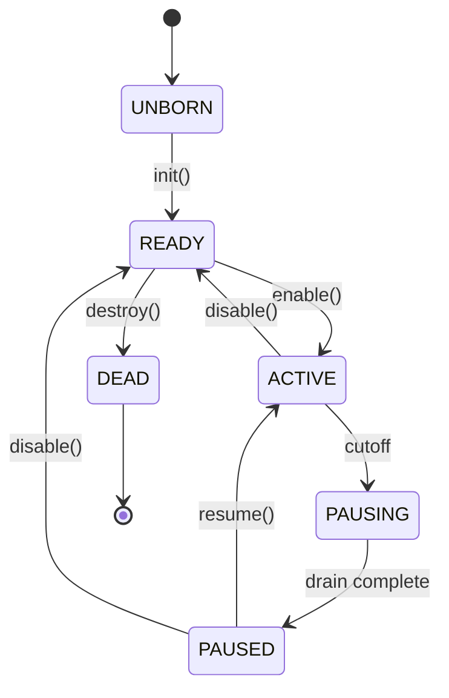

# Design: nonux

**Project:** nonux
**Created:** 2026-04-17
**Last Updated:** 2026-05-04 (Session 104 — slice 8.7 + two-tier slot model planned; Phase 8 closed)

---

## Navigation

**Project Docs:** [README](README.md) | [SPEC](SPEC.md) | [DESIGN](DESIGN.md) *(you are here)* | [IMPLEMENTATION-GUIDE](IMPLEMENTATION-GUIDE.md) | [HANDOFF](HANDOFF.md)

**This Document:**
- [Design Philosophy](#design-philosophy)
- [Architecture Overview](#architecture-overview)
- [The Component Model](#the-component-model)
- [Kernel Core](#kernel-core)
- [Reference Counting](#reference-counting)
- [Handle System](#handle-system)
- [IPC Framework](#ipc-framework)
- [Component Lifecycle](#component-lifecycle)
- [Slot-Based Indirection](#slot-based-indirection)
- [Stateful vs Stateless Connections](#stateful-vs-stateless-connections)
- [Recomposition Protocol](#recomposition-protocol)
- [Execution Model (v1)](#execution-model-v1) — includes [Scheduler: Core Driver + Component](#scheduler-core-driver--component)
- [Dependency Management](#dependency-management)
- [Component Graph Registry](#component-graph-registry)
- [Hooking Framework](#hooking-framework)
- [Configuration and Manifests](#configuration-and-manifests)
- [Component Testing](#component-testing)
- [Key Design Decisions](#key-design-decisions)
- [Data Model](#data-model)
- [Design Evolution](#design-evolution)

---

## Design Philosophy

**1. Composition over integration**
- The kernel is a graph of components wired together through typed interfaces, not a blob of compiled-together code. Every boundary is explicit. You can draw the component graph on a whiteboard and it matches the code 1:1.

**2. AI-operable by default**
- Every component ships machine-readable metadata (JSON manifests). Configuration is declarative. Naming is predictable. An AI agent should never need to "figure out" how something works from reading C code alone — the manifest and interface docs tell the full story.

**3. Software discipline over hardware enforcement**
- Privileged-mode services share an address space for performance. Correctness comes from documented ownership, clean interfaces, and comprehensive testing — not page table tricks. This is a deliberate trade-off: we accept the risk of a bug crashing the kernel in exchange for simplicity and performance. The test infrastructure catches bugs before they reach production configs.

**4. Everything is hookable**
- Any message, any syscall, any lifecycle transition can be intercepted. This isn't a debug feature bolted on later — the dispatch paths are designed with hook points from the start.

---

## Architecture Overview

<svg xmlns="http://www.w3.org/2000/svg" viewBox="0 0 720 620" width="720" height="620" font-family="sans-serif" font-size="12">
  <rect width="720" height="620" fill="white"/>
  <defs>
    <marker id="arr" viewBox="0 0 10 10" refX="9" refY="5" markerWidth="7" markerHeight="7" orient="auto">
      <path d="M0,0 L10,5 L0,10 z" fill="#333"/>
    </marker>
  </defs>

  <!-- User Space outer -->
  <rect x="10" y="10" width="700" height="150" rx="8" fill="#e6f2ff" stroke="#333" stroke-width="1.5"/>
  <text x="20" y="28" font-weight="bold">User Space (EL0)</text>

  <!-- Apps -->
  <g stroke="#333" stroke-width="1" fill="#ffffff">
    <rect x="30"  y="40" width="150" height="50" rx="4"/>
    <rect x="200" y="40" width="150" height="50" rx="4"/>
    <rect x="370" y="40" width="150" height="50" rx="4"/>
    <rect x="540" y="40" width="150" height="50" rx="4"/>
  </g>
  <g text-anchor="middle">
    <text x="105" y="62">busybox</text>   <text x="105" y="78" font-style="italic" fill="#555">(POSIX)</text>
    <text x="275" y="62">app 1</text>     <text x="275" y="78" font-style="italic" fill="#555">(native)</text>
    <text x="445" y="62">app 2</text>     <text x="445" y="78" font-style="italic" fill="#555">(native)</text>
    <text x="615" y="68">test runner</text>
  </g>

  <!-- POSIX shim -->
  <rect x="30" y="105" width="660" height="45" rx="4" fill="#cce0f5" stroke="#333"/>
  <text x="360" y="124" text-anchor="middle" font-weight="bold">POSIX Compatibility Shim</text>
  <text x="360" y="140" text-anchor="middle" fill="#555">maps POSIX calls → handle ops</text>

  <!-- Arrows apps → shim -->
  <g stroke="#333" stroke-width="1" fill="none" marker-end="url(#arr)">
    <line x1="105" y1="90" x2="105" y2="104"/>
    <line x1="275" y1="90" x2="275" y2="104"/>
    <line x1="445" y1="90" x2="445" y2="104"/>
    <line x1="615" y1="90" x2="615" y2="104"/>
  </g>

  <!-- EL0/EL1 boundary -->
  <line x1="10" y1="172" x2="710" y2="172" stroke="#999" stroke-width="1" stroke-dasharray="5,4"/>
  <text x="710" y="169" text-anchor="end" fill="#666" font-size="10">syscall boundary (EL0 → EL1)</text>

  <!-- Handle Table -->
  <rect x="30" y="180" width="660" height="40" rx="4" fill="#e8d9f5" stroke="#333"/>
  <text x="360" y="205" text-anchor="middle" font-weight="bold">Handle Table — per-process typed handles + permissions</text>

  <!-- Component Framework -->
  <rect x="30" y="240" width="660" height="80" rx="6" fill="#fff4cc" stroke="#333" stroke-width="1.5"/>
  <text x="40" y="258" font-weight="bold">Component Framework</text>
  <g stroke="#333" stroke-width="1" fill="#ffffff">
    <rect x="45"  y="268" width="150" height="42" rx="4"/>
    <rect x="205" y="268" width="150" height="42" rx="4"/>
    <rect x="365" y="268" width="150" height="42" rx="4"/>
    <rect x="525" y="268" width="150" height="42" rx="4"/>
  </g>
  <g text-anchor="middle">
    <text x="120" y="294">Hook Dispatch</text>
    <text x="280" y="294">Lifecycle Manager</text>
    <text x="440" y="294">IPC Router</text>
    <text x="600" y="294">Config Manager</text>
  </g>

  <!-- Component Slots -->
  <rect x="30" y="340" width="660" height="92" rx="6" fill="#e6f5d0" stroke="#333" stroke-width="1.5"/>
  <text x="40" y="358" font-weight="bold">Component Slots (wired by config)</text>
  <g stroke="#333" stroke-width="1" fill="#ffffff">
    <rect x="45"  y="366" width="150" height="58" rx="4"/>
    <rect x="205" y="366" width="150" height="58" rx="4"/>
    <rect x="365" y="366" width="150" height="58" rx="4"/>
    <rect x="525" y="366" width="150" height="58" rx="4"/>
  </g>
  <g text-anchor="middle">
    <text x="120" y="389">Scheduler slot</text><text x="120" y="408" fill="#555" font-style="italic">impl: round-robin</text>
    <text x="280" y="389">Memory Mgr slot</text><text x="280" y="408" fill="#555" font-style="italic">impl: buddy</text>
    <text x="440" y="389">VFS slot</text>       <text x="440" y="408" fill="#555" font-style="italic">impl: ramfs</text>
    <text x="600" y="389">Device Driver</text>  <text x="600" y="408" fill="#555" font-style="italic">impl: virtio-uart</text>
  </g>

  <!-- Kernel Core -->
  <rect x="30" y="452" width="660" height="78" rx="6" fill="#ffe4cc" stroke="#333" stroke-width="1.5"/>
  <text x="40" y="470" font-weight="bold">Kernel Core (frozen)</text>
  <g stroke="#333" stroke-width="1" fill="#ffffff">
    <rect x="45"  y="478" width="200" height="42" rx="4"/>
    <rect x="260" y="478" width="200" height="42" rx="4"/>
    <rect x="475" y="478" width="200" height="42" rx="4"/>
  </g>
  <g text-anchor="middle">
    <text x="145" y="504">CPU Context Switch</text>
    <text x="360" y="504">Physical Memory Allocator</text>
    <text x="575" y="504">Interrupt Dispatch</text>
  </g>

  <!-- Hardware -->
  <rect x="30" y="550" width="660" height="48" rx="4" fill="#e8e8e8" stroke="#333"/>
  <text x="360" y="571" text-anchor="middle" font-weight="bold">Hardware (ARM64)</text>
  <text x="360" y="588" text-anchor="middle" fill="#555">QEMU virt: GIC, UART, virtio</text>

  <!-- Vertical flow arrows between layers -->
  <g stroke="#333" stroke-width="1.5" fill="none" marker-end="url(#arr)">
    <line x1="360" y1="150" x2="360" y2="179"/>
    <line x1="360" y1="220" x2="360" y2="239"/>
    <line x1="360" y1="320" x2="360" y2="339"/>
    <line x1="360" y1="432" x2="360" y2="451"/>
    <line x1="360" y1="530" x2="360" y2="549"/>
  </g>
</svg>

### Layers

The system has four distinct layers, top to bottom:

1. **User Space** — Applications, busybox, test runners. They see either POSIX (via the shim) or the native handle-based API.
2. **Component Framework** — The machinery that makes composition work: IPC routing, lifecycle management, hook dispatch, configuration. This layer is part of the kernel but sits above the swappable components.
3. **Component Slots** — The swappable pieces. Each slot has a type (scheduler, memory manager, VFS, driver) and a currently-loaded implementation. Wired together by the kernel config.
4. **Kernel Core** — The frozen primitives: context switching, physical page allocator, interrupt vectors. These cannot be swapped at runtime.

---

## The Component Model

### What is a Component?

A component is the fundamental unit of composition in nonux. It is:
- A directory in the source tree with source files, a JSON manifest, and interface docs
- An implementation of one or more **interface types** (e.g., "scheduler", "block_device")
- A self-contained unit with explicit dependencies — no reaching into other components' internals

### Interface Types

An interface type defines a contract: a set of functions and/or message types that any implementation must provide. Examples:

| Interface Type | Purpose | Key Operations |
|---|---|---|
| `scheduler` | CPU time allocation | `pick_next`, `enqueue`, `dequeue`, `yield`, `set_priority` |
| `mem_manager` | Virtual memory management | `map`, `unmap`, `alloc_region`, `fault_handler` |
| `vfs` | Filesystem abstraction | `mount`, `open`, `read`, `write`, `readdir`, `stat` |
| `block_device` | Block I/O | `read_block`, `write_block`, `flush`, `get_info` |
| `char_device` | Character I/O | `read`, `write`, `ioctl` |
| `net_stack` | Networking | `send`, `recv`, `bind`, `listen`, `connect` |

Each interface type is defined by a C header file and a JSON schema for its message types.

### Component Directory Layout

```
components/
  sched_rr/                     # Round-robin scheduler
    manifest.json               # Machine-readable metadata
    sched_rr.c                  # Implementation
    sched_rr.h                  # Internal header (not the interface)
    README.md                   # Human-readable docs
    test/
      test_sched_rr.c           # Unit tests
  sched_priority/               # Priority scheduler (same interface) — slice 8.4
    manifest.json
    sched_priority.c            # 8 priority buckets (0=default, 7=highest); set_priority works
    README.md
```

### Manifest Example

```json
{
  "name": "sched_rr",
  "version": "0.1.0",
  "type": "scheduler",
  "description": "Simple round-robin scheduler with configurable time quantum",
  "mutability": "hot-swappable",
  "concurrency": "serialized",
  "pause_policy": "queue",

  "provides": ["scheduler"],
  "requires": {
    "timer": ">=0.1.0"
  },
  "optional": {
    "stats_collector": ">=0.1.0"
  },

  "config": {
    "time_quantum_ms": {
      "type": "int",
      "default": 10,
      "min": 1,
      "max": 1000,
      "description": "Time slice per task in milliseconds"
    }
  },

  "interface": {
    "pick_next": {
      "description": "Select next task to run",
      "params": {},
      "returns": { "type": "task*", "ownership": "borrow" }
    },
    "enqueue": {
      "description": "Add task to run queue",
      "params": {
        "task": { "type": "task*", "ownership": "borrow" }
      },
      "returns": { "type": "int", "ownership": "value" }
    },
    "dequeue": {
      "description": "Remove task from run queue",
      "params": {
        "task": { "type": "task*", "ownership": "borrow" }
      },
      "returns": { "type": "int", "ownership": "value" }
    },
    "yield": {
      "description": "Current task yields CPU",
      "params": {},
      "returns": { "type": "void" }
    },
    "set_priority": {
      "description": "Set task scheduling priority",
      "params": {
        "task": { "type": "task*", "ownership": "borrow" },
        "priority": { "type": "int", "ownership": "value" }
      },
      "returns": { "type": "int", "ownership": "value" }
    }
  },

  "build": {
    "sources": ["sched_rr.c"],
    "cflags": [],
    "deps": []
  }
}
```

### Ownership Types

Every parameter and return value that involves a pointer or handle declares one of four ownership types in the manifest's `interface` section:

| Ownership | Meaning | Who frees? | Example |
|---|---|---|---|
| `transfer` | Caller gives up ownership | Callee | `submit_buffer(buf*)` — callee owns buf after call |
| `borrow` | Caller retains ownership, pointer valid only during call | Caller (later) | `enqueue(task*)` — scheduler reads task but doesn't own it |
| `shared` | Reference-counted, last holder frees | Ref-count hits 0 | `get_vmo(vmo*)` — both caller and callee hold a ref |
| `static` | Kernel-lifetime object, nobody frees | Never freed | `get_name()` — returns pointer to component's static name string |
| `value` | Not a pointer — plain value type (int, enum, etc.) | N/A | Return codes, sizes, flags |

Rules:
- Every pointer parameter and pointer return **must** have an ownership annotation. Missing annotation is a manifest validation error.
- Plain value types (int, size_t, enum) use `value` — no ownership tracking needed.
- `void` returns have no ownership field.
- The interface conformance tests verify ownership contracts: e.g., after calling a `borrow` function, the test confirms the pointer is still valid and unmodified.

---

## Kernel Core

The kernel core is the **frozen** layer — components that cannot be swapped at runtime because everything else depends on them.

### Core Components

**CPU Abstraction (`core/cpu/`)**
- Context switch (save/restore registers, stack pointer, EL1/EL0 transition)
- Exception vector table (EL1 sync, IRQ, FIQ, SError)
- Timer setup (ARM generic timer for scheduling ticks)
- Single-core for v1

**Physical Memory Allocator (`core/pmm/`)**
- Page-granularity allocation (4KB pages)
- Simple bitmap or buddy allocator
- This is the *physical* allocator only — virtual memory management is a swappable component above

**Interrupt Dispatch (`core/irq/`)**
- GIC (Generic Interrupt Controller) driver for QEMU virt
- Routes interrupts to registered handlers
- Hook points: pre-dispatch, post-dispatch

**Boot (`core/boot/`)**
- ARM64 boot stub (set up EL1, MMU identity map, stack, jump to C)
- Device tree parsing (QEMU passes DTB)
- Component initialization sequencing

### Core Interfaces

The core exposes these interfaces upward to components:

```c
/* Physical page allocation */
void *pmm_alloc_page(void);
void  pmm_free_page(void *page);
void *pmm_alloc_pages(size_t count);

/* Interrupt registration */
int  irq_register(unsigned int irq_num, irq_handler_t handler, void *data);
void irq_unregister(unsigned int irq_num);

/* Context switch (called by scheduler) */
void cpu_switch_to(struct task *prev, struct task *next);

/* Timer */
void timer_set_interval(unsigned int ms);
```

---

## Reference Counting

Objects with `shared` ownership are reference-counted. nonux has two refcount mechanisms — one for userspace (handles) and one for kernel-internal sharing.

### Kernel Refcount (`nx_ref`)

Kernel objects that can be shared between components embed a refcount:

```c
struct nx_ref {
    atomic_int count;                       /* current reference count */
    void (*destroy)(void *obj);             /* called when count reaches 0 */
};

/* Initialize — count starts at 1 (creator holds first ref) */
static inline void nx_ref_init(struct nx_ref *ref, void (*destroy)(void *)) {
    atomic_store_explicit(&ref->count, 1, memory_order_relaxed);
    ref->destroy = destroy;
}

/* Acquire a reference */
static inline void nx_ref_get(struct nx_ref *ref) {
    atomic_fetch_add_explicit(&ref->count, 1, memory_order_relaxed);
}

/* Release a reference — returns true if object was destroyed */
static inline bool nx_ref_put(struct nx_ref *ref, void *obj) {
    /* acq_rel: release prior writes to other refholders; acquire the
     * destroy path so we see all prior updates before freeing. */
    if (atomic_fetch_sub_explicit(&ref->count, 1, memory_order_acq_rel) == 1) {
        ref->destroy(obj);
        return true;
    }
    return false;
}
```

Atomics are required even on uniprocessor: the kernel is preemptive, so
`count++` (load, add, store) can be interrupted between the load and store,
losing an increment. The `acq_rel` ordering on `nx_ref_put` ensures the
destroy callback observes all writes made by previous refholders.

Usage in a shared kernel object:

```c
struct vmo {
    struct nx_ref ref;          /* embedded refcount */
    size_t        size;
    void         *pages;
};

static void vmo_destroy(void *obj) {
    struct vmo *vmo = obj;
    free_pages(vmo->pages, vmo->size);
    kfree(vmo);
}

/* Create — caller gets first ref */
struct vmo *vmo_create(size_t size) {
    struct vmo *vmo = kmalloc(sizeof(*vmo));
    vmo->size = size;
    vmo->pages = alloc_pages(size);
    nx_ref_init(&vmo->ref, vmo_destroy);
    return vmo;
}

/* Share — callee gets a ref */
void share_vmo(struct vmo *vmo) {
    nx_ref_get(&vmo->ref);
    /* pass vmo to another component */
}

/* Done with it — release ref */
void release_vmo(struct vmo *vmo) {
    nx_ref_put(&vmo->ref, vmo);  /* may destroy */
}
```

### Handle Refcount (Userspace)

For userspace objects, the handle table *is* the refcount — no separate `nx_ref` needed:

- Each handle pointing to an object is one reference
- `nx_handle_duplicate()` creates a new handle → refcount++
- `nx_handle_close()` removes a handle → refcount--
- When the last handle is closed → object's destroy callback fires
- When a process exits, all its handles are closed (automatic cleanup)

The kernel object still embeds `nx_ref` internally, but handle operations call `nx_ref_get`/`nx_ref_put` under the hood — so both kernel-internal and userspace references use the same counter:

```c
nx_status_t nx_handle_duplicate(nx_handle_t handle, uint32_t rights, nx_handle_t *out) {
    struct handle *h = handle_lookup(current_task, handle);
    if (!h) return NX_ERR_BAD_HANDLE;
    if ((h->rights & rights) != rights) return NX_ERR_ACCESS_DENIED;

    nx_ref_get(object_ref(h->object));     /* increment shared refcount */
    *out = handle_create(current_task, h->type, rights, h->object);
    return NX_OK;
}

nx_status_t nx_handle_close(nx_handle_t handle) {
    struct handle *h = handle_lookup(current_task, handle);
    if (!h) return NX_ERR_BAD_HANDLE;

    handle_remove(current_task, handle);
    nx_ref_put(object_ref(h->object), h->object);  /* may destroy object */
    return NX_OK;
}
```

### Refcount Rules

| Rule | Enforcement |
|---|---|
| Every `shared` object must embed `struct nx_ref` | Manifest validation — `shared` return type requires refcounted object |
| Creator starts at refcount 1 | `nx_ref_init` sets count = 1 |
| Every `nx_ref_get` must have a matching `nx_ref_put` | Memory tracking layer detects leaked refs in tests |
| Refcount must never go below 0 | `nx_ref_put` asserts `count > 0` (debug build) |
| Destroy callback must free all owned resources | Lifecycle tests verify zero allocations after last ref dropped |
| Handles and kernel refs share the same counter | One `nx_ref` per object — handles call `nx_ref_get`/`put` internally |

---

## Handle System

Handles are the native API for userspace. Every kernel object a process can interact with is accessed through a typed handle.

### Handle Structure

```c
struct handle {
    uint32_t      id;           /* per-process unique ID */
    uint32_t      type;         /* HANDLE_CHANNEL, HANDLE_VMO, HANDLE_PROCESS, ... */
    uint32_t      rights;       /* bitmask of permitted operations */
    void         *object;       /* pointer to kernel object */
    struct task  *owner;        /* owning process */
};
```

### Handle Types

| Type | Object | Key Rights |
|---|---|---|
| `HANDLE_CHANNEL` | IPC channel endpoint | `RIGHT_READ`, `RIGHT_WRITE`, `RIGHT_TRANSFER` |
| `HANDLE_VMO` | Virtual memory object | `RIGHT_READ`, `RIGHT_WRITE`, `RIGHT_MAP`, `RIGHT_TRANSFER` |
| `HANDLE_PROCESS` | Process | `RIGHT_SIGNAL`, `RIGHT_WAIT`, `RIGHT_INFO` |
| `HANDLE_THREAD` | Thread | `RIGHT_SIGNAL`, `RIGHT_WAIT`, `RIGHT_SUSPEND` |
| `HANDLE_IRQ` | Interrupt source | `RIGHT_WAIT`, `RIGHT_ACK` |
| `HANDLE_FILE` | File (via VFS) | `RIGHT_READ`, `RIGHT_WRITE`, `RIGHT_SEEK` |

### Syscall Interface

Syscalls operate on handles, not file descriptors or global names:

```c
/* Core handle operations */
nx_status_t nx_handle_close(nx_handle_t handle);
nx_status_t nx_handle_duplicate(nx_handle_t handle, uint32_t rights, nx_handle_t *out);

/* Channel operations */
nx_status_t nx_channel_create(nx_handle_t *end0, nx_handle_t *end1);
nx_status_t nx_channel_send(nx_handle_t channel, const void *data, size_t len,
                            const nx_handle_t *handles, size_t num_handles);
nx_status_t nx_channel_recv(nx_handle_t channel, void *data, size_t len,
                            nx_handle_t *handles, size_t num_handles);

/* Memory objects */
nx_status_t nx_vmo_create(size_t size, nx_handle_t *out);
nx_status_t nx_vmo_map(nx_handle_t vmo, void **addr, size_t offset, size_t len);

/* Process management */
nx_status_t nx_process_create(nx_handle_t *proc, nx_handle_t *root_channel);
nx_status_t nx_process_start(nx_handle_t proc, uintptr_t entry, uintptr_t stack);
nx_status_t nx_process_wait(nx_handle_t proc, int *exit_code);
```

### Rights Attenuation

Handles can be duplicated with reduced rights — never increased:

```c
/* Give child process a read-only channel */
nx_handle_t readonly;
nx_handle_duplicate(channel, RIGHT_READ, &readonly);
/* Pass readonly to child via its root channel */
```

This is how per-process API surfaces work: a sandboxed process receives handles with restricted rights. No global capability — only what was explicitly given.

### Two-Tier Slot Model (planned — Phase 9b)

**Problem.** The registry requires every slot to be named and globally enumerable. A naive "handle-as-slot" design (one registered slot per open file descriptor) would flood the registry with thousands of ephemeral entries, break the O(n-slots) pause-order sort, and make the config snapshot unreadable.

**Insight.** The registry serves three distinct purposes, and only the first is structurally required by every slot:

| Purpose | Required by | Required by per-fd slots? |
|---|---|---|
| Pause/drain topological sort | `build_pause_order` walks `incoming`/`outgoing` edge lists | Yes — but edge lists suffice; no global list needed |
| Name-based lookup | `nx_slot_lookup`, config swap/rewire API | No — per-fd slots are never config-swapped by name |
| Observable composition graph | config snapshot, `verify-registry`, AI operability | No — per-fd topology is not an architectural boundary |

The structural bottleneck appears to be that `incoming`/`outgoing` edge lists live in `slot_node`, but no struct migration is actually needed.  `nx_slot_call_blocking` finds the connection by walking `src->outgoing` (`find_outgoing_edge`); for anonymous sources there is no outgoing list.  The fix is to flip the lookup: walk `dst->incoming` instead (`find_incoming_edge(dst, src)` matching `c->from_slot == src`).  The target slot IS registered, so its `incoming` list already holds the conn_node — `nx_connection_register` writes it there unconditionally via `slot_add_incoming(to_sn, n)`.  The only other change is relaxing `nx_connection_register` to accept an unregistered non-NULL `from` (currently rejected with `NX_ENOENT`); the `slot_add_outgoing` call is already conditional on `from_sn != NULL` and becomes a no-op for anonymous sources.

**Two-tier model.**

- **Architectural slots** — named, registered, config-swappable, visible in snapshots and `verify-registry`. Today there are seven (scheduler, mm, vfs, char_device.serial, filesystem.root, filesystem.proc, posix_shim). This set grows slowly, only when a new kernel subsystem boundary is introduced.
- **Ephemeral (anonymous) slots** — unregistered, known only to their direct peers. Created and destroyed with the object they represent. Not config-swappable individually. Never appear in snapshots or `verify-registry`. The pause/drain protocol works transparently because: (a) ephemeral slots are leaf nodes — no other component holds an incoming edge to them, so they never appear in a pause order; (b) `in_flight_calls` on the registered *target* slot (vfs_simple, char_device, etc.) counts all callers regardless of whether the caller slot is registered.

**Handle table evolution.** `struct nx_handle_entry` embeds a `struct nx_slot`. The handle table becomes a per-process capability table where each file/channel/console entry is an anonymous slot with an outgoing edge to the backing architectural slot (vfs_simple, uart_pl011, etc.). `sys_read(fd)` resolves to: look up fd's embedded slot → `nx_slot_call_blocking` → dispatcher routes to backing component. The entire `switch (handle_type)` in `sys_read`/`sys_write` disappears; routing is data-driven by the slot's edge.

**Invariant #1 update.** The current invariant ("every `struct slot *` reachable from any component is registered") narrows to: "every *architectural* slot ref reachable from any component is registered; ephemeral slots are visible only to their direct peers and are exempt."

**Deferred.** Implementation is Phase 9b; see [IMPLEMENTATION-GUIDE.md §Phase 9b](IMPLEMENTATION-GUIDE.md#phase-9b-ephemeral-slots-and-handles-as-capabilities).

---

## IPC Framework

### Async-First Design

All inter-component communication goes through the IPC router. The default mode is async:

```
Sender                  IPC Router                 Receiver
  │                         │                          │
  │── send(msg) ──────────>│                          │
  │   (returns immediately) │── enqueue(msg) ────────>│
  │                         │                          │── process(msg)
  │                         │                          │── send(reply)
  │                         │<── enqueue(reply) ───────│
  │<── deliver(reply) ──────│                          │
```

### Sync Shortcut

When a connection is configured as synchronous (in the kernel config or changed at runtime):

```
Sender                  IPC Router                 Receiver
  │                         │                          │
  │── send(msg) ──────────>│                          │
  │   (blocks)              │── deliver(msg) ────────>│
  │                         │                          │── process(msg)
  │                         │<── reply(result) ────────│
  │<── return(result) ──────│                          │
  │   (unblocks)            │                          │
```

The component code is identical in both cases — it calls `ipc_send()` and `ipc_recv()`. The router handles the blocking/unblocking transparently.

#### Sync-mode caller must be on a dispatcher

The "router invokes the receiver's handler on the caller's stack" shortcut is only valid when the caller is itself a framework-owned dispatcher thread (a per-CPU dispatcher, or a `dedicated` component's private thread). The handler's body must execute somewhere R8 (slot-resolve locality) holds, and that's exactly the dispatcher's domain.

This bounds where `mode: sync` can be used:

- **Dispatcher-to-dispatcher edges (e.g. `vfs → block_virtio`):** sync is fine. The caller is a dispatcher inside `vfs_simple`'s handler; the receiver's handler runs on the same stack with `preempt_disable()` already held.
- **Syscall-entry edges (e.g. `posix_shim → vfs`, `posix_shim → scheduler`, `posix_shim → mm`):** sync is **not** valid. The "caller" is a userspace task that just trapped via SVC; the kernel-side `posix_shim` runs on that task's kstack, which is not a dispatcher. Running a receiver handler there would let `slot->active` be read off-dispatcher, breaking the drain step's completeness guarantee. All four `posix_shim → service` edges in slice 8.0a's `kernel.json` are therefore `mode: async`; the kernel-side blocking-call infra ([SLOT-CALL-API.md](SLOT-CALL-API.md)) implements "block on reply waitq, dispatcher runs handler" semantics that look synchronous to the syscall caller but route the request through the dispatcher.

The framework does not yet enforce this at config-validation time — it's an AI-verified rule today. A future `verify-registry` extension can flag a `mode: sync` edge whose `from_slot` belongs to a component that runs on a non-dispatcher context (the per-task `caller_slot` introduced in slice 8.0a is the canonical instance).

### Message Format

```c
struct ipc_message {
    struct slot   *src_slot;         /* sender slot; dispatcher fills from handler
                                      * context or worker's captured self->slot.
                                      * Used for audit / cap-check / trace, not
                                      * for reply routing (see §IPC — Reply Routing). */
    struct slot   *dst_slot;         /* destination slot; the dispatcher reads
                                      * dst_slot->active at dequeue time. */
    uint32_t       msg_type;         /* interface-specific message type */
    uint32_t       flags;            /* MSG_FLAG_REPLY, MSG_FLAG_ONEWAY, ... */
    uint32_t       payload_len;      /* bytes */
    uint8_t        payload[];        /* flexible array */
};
```

### Connection Configuration

```json
{
  "connections": [
    {
      "from": "vfs",
      "to": "block_virtio",
      "mode": "sync",
      "stateful": true,
      "hooks": ["trace_ipc"]
    },
    {
      "from": "posix_shim",
      "to": "vfs",
      "mode": "async",
      "stateful": true,
      "hooks": []
    },
    {
      "from": "posix_shim",
      "to": "scheduler",
      "mode": "async",
      "stateful": false,
      "hooks": []
    }
  ]
}
```

The `mode` field can be changed at runtime via the config manager. The framework drains in-flight messages before switching.

> **Why every `posix_shim → *` edge here is `mode: async`:** see §"Sync-mode caller must be on a dispatcher" above. An earlier draft of this section listed `posix_shim → scheduler` as `mode: sync`; that was incorrect because the syscall caller's task is not a dispatcher thread. Updated in slice 8.0a alongside the kernel-side blocking-call infrastructure.

#### Every Component Occupies a Slot

`from` and `to` in the connection graph are both slot names. **Every component that has a lifecycle (`init`/`enable`/`pause`/`destroy`) occupies a slot**, even if nothing else in the in-kernel graph ever sends *to* it. `posix_shim` is the canonical example: no in-kernel connection lists it as `to`, yet it has a `posix_shim` slot. Three reasons this is uniform rather than an exception:

- **Hot-swap uniformity.** Replacing the POSIX surface goes through the same pause/drain/swap protocol as any other component. No second swap path.
- **Sender identity.** `src_slot` in `struct ipc_message` is well-defined for every sender — the handler or worker runs on behalf of some slot's active impl. No reserved `SLOT_FRAMEWORK` sentinel, no special case in R5 (cap-audit "sender legitimately holds this cap").
- **Entry-boundary components are just components.** `posix_shim` is the boundary between userspace syscall entry and the in-kernel graph; the syscall-entry trampoline resolves the `posix_shim` slot the same way any dispatcher resolves a destination. "Nothing sends to it from inside the graph" is a property of the connection list, not of the slot.

The only things without slots are non-component code paths — ISRs, the syscall-entry trampoline itself, the boot sequencer — which are framework machinery, not components.

#### Tasks as IPC Senders

A **task** (the schedulable entity in `core/sched/task.h`) is not a component — it has no `init/enable/pause/destroy` lifecycle, no manifest, no descriptor — but it can be the *origin* of a cross-component call. Most concretely: a userspace task that traps via SVC into the kernel-side `posix_shim` becomes the sender of every blocking call that posix_shim's handler issues onward to vfs / scheduler / mm / char_device. For the registry's two foundational invariants ("every slot ref reachable from any sender is registered" and "every call goes through a registered connection") to hold for those edges, the task must be a graph entity with its own slot identity.

Slice 8.0a promotes every task to a slot-bearing entity by embedding a `caller_slot` in `struct nx_task`. The slot is created at `nx_task_create` and unregistered at `nx_task_destroy`; its `active` is bound to the singleton `posix_shim` component. The task's slot serves as `msg->src_slot` for every blocking call the task issues — giving the IPC router, the cap-scan, the hold queue, and the registry a well-defined sender identity.

Tasks remain scheduling entities; the slot is purely an identity for the graph. Tasks do not declare manifests, do not own dependencies in the manifest sense, and do not appear in `kernel.json`. The framework synthesizes their slot identity at task-create time. See [SLOT-CALL-API.md](SLOT-CALL-API.md) §"Per-Task `caller_slot`" for the runtime mechanics.

---

## Component Lifecycle

Every component implements these callbacks:

```c
struct component_ops {
    /* Lifecycle */
    int  (*init)(struct component *self, const struct config *cfg);
    int  (*enable)(struct component *self);
    int  (*pause)(struct component *self);    /* finish current op, enter quiescent */
    int  (*resume)(struct component *self);   /* return to active processing */
    int  (*disable)(struct component *self);
    void (*destroy)(struct component *self);

    /* Optional: state migration for hot-swap */
    int  (*migrate_export)(struct component *self, void **state, size_t *len);
    int  (*migrate_import)(struct component *self, const void *state, size_t len);

    /* Optional: notification when a stateful dependency is swapped */
    int  (*on_dep_swapped)(struct component *self, struct slot *dep_slot,
                           struct component *old_impl, struct component *new_impl,
                           uint32_t flags);  /* SWAP_STATE_MIGRATED or SWAP_STATE_LOST */
};
```

### State Machine



`PAUSING` is the intermediate state during the pause protocol: once the cutoff is issued, new messages are rejected while queued messages continue to drain. The component reaches `PAUSED` only when the drain is complete.

### Hot-Swap Sequence

```
1. Framework: mark old component DRAINING
   - No new messages routed to it
   - Wait for in-flight messages to complete
2. Framework: call old->disable()
   - Component releases all resources
   - State: ACTIVE → READY
3. Optional: call old->migrate_export() → state blob
4. Framework: call old->destroy()
   - State: READY → DEAD
5. Framework: call new->init(config)
   - State: UNBORN → READY
6. Optional: call new->migrate_import(state blob)
7. Framework: call new->enable()
   - State: READY → ACTIVE
8. Framework: resume message routing to new component
```

### Mutability Enforcement

```c
/* In the framework's swap handler */
int component_swap(struct slot *slot, struct component *new_impl) {
    if (slot->mutability == MUTABILITY_FROZEN)
        return -NX_ERR_FROZEN;       /* rejected */

    if (slot->mutability == MUTABILITY_WARM)
        pause_dependents(slot);       /* brief pause */

    return do_hot_swap(slot, new_impl);
}
```

### Slot-Based Indirection

Components never hold direct pointers to each other. All inter-component calls go through a **slot**, and the framework resolves the current active implementation at call time:

```c
/* Components hold slot references, not ops pointers */
struct vfs_deps {
    struct slot *block_dev;    /* resolved by framework */
};

/* Calling through a slot — this function runs inside a message handler,
 * i.e. on a dispatcher thread. Slot dereference is only legal here. */
int vfs_read_block(struct vfs_component *self, uint64_t block, void *buf) {
    struct slot *blk = self->deps.block_dev;
    /* Always dispatches to current active impl — hot-swap transparent */
    return blk->active->ops->read_block(blk->active, block, buf);
}
```

This means hot-swap never leaves stale pointers — the slot always points to the current implementation.

##### Multi-slot binding (N:1)

The default case is a single slot bound to a single component instance. The data model — `component_node.active_in: list<slot>` — already supports a single component instance being the active impl of multiple slots, and slice 8.0a relies on that: every per-task `caller_slot` (one per task) is bound to the singleton `posix_shim` component instance, so with `NX_PROCESS_TABLE_CAPACITY = 128` tasks, a single posix_shim component is the active impl of 128+ slots simultaneously.

Two implications for the protocols:

- **Pause/swap walks via `nx_component_foreach_bound_slot`.** "Pause posix_shim" is not "set one slot's pause_state to CUTTING" — it's "walk every slot whose `active` is the posix_shim component, set each one's pause_state, drain each one's inbox". The framework's pause primitive remains slot-side (per the §Pause Implementation pseudocode); the orchestrator iterates the component's bound-slot list to apply it across the N:1 fan-out. Callers of the pause primitive may operate on either a single slot (the existing per-slot path) or a component (the N:1 path); both ultimately mutate slot-side `pause_state` because that is where the IPC router reads it.
- **Edge enumeration is per-slot, not per-component.** Each per-task caller_slot has its own outgoing edges (registered at task_create — see §"Tasks as IPC Senders" + §"Component Graph Registry — Edge inheritance"). The component_node's `active_in` list lets the framework walk to slots; edges live on slots.

Pause-protocol cost scales linearly with the number of bound slots. For N=128 task slots, a posix_shim swap pauses 128 slots; the per-slot pause is O(inbox depth) and inboxes are typically empty for blocking-call senders (each task has at most one outstanding call). So total pause time is dominated by walk + state writes, not by drain.

##### Slot-side pause + blocking-call metadata

Slots carry pause-protocol metadata that the IPC router and (for slice 8.0a) the blocking-call wrapper consult:

- `_Atomic(enum nx_slot_pause_state) pause_state` — `NONE / CUTTING /
  DRAINING / DONE`. Written by the pause protocol, read by the router
  on every send. Atomic from day one so the SMP upgrade is a barrier
  change, not a restructure. *(Slice 3.8.)*
- `struct nx_slot *fallback` — target for the `NX_PAUSE_REDIRECT`
  policy. Configured via `nx_slot_set_fallback`. A paused slot with
  `REDIRECT` policy and `fallback == NULL` returns `NX_ENOENT` to the
  sender (fail-closed); the router has a depth-4 loop guard that
  returns `NX_ELOOP` when a fallback chain folds back on itself. *(Slice 3.8.)*
- `struct nx_waitq resume_waitq` — `QUEUE`-policy callers blocked on a
  paused slot wait here; resume's `nx_waitq_wake_all` releases all
  blocked callers atomically. The blocking-call wrapper
  ([SLOT-CALL-API.md](SLOT-CALL-API.md) §"Pause Protocol Interaction")
  reads this field from caller (non-dispatcher) context — atomic-load
  semantics make that safe; R8 is not violated because `slot->active`
  is not touched. *(Slice 8.0a.)*
- `_Atomic(uint32_t) in_flight_calls` — the dispatcher kthread
  increments this before invoking a slot's handler and decrements after.
  The pause protocol's drain step waits for the counter to reach 0
  before transitioning `DRAINING → DONE`, guaranteeing no handler is
  running on the slot when a swap proceeds. The counter belongs on the
  slot rather than the component because handler-in-progress is the
  slot's invariant, not the component's (mid-swap, the slot is between
  two components). *(Slice 8.0a.)*

Reading these fields off the dispatcher (e.g. by the blocking-call wrapper on a syscall-caller's task stack) is permitted: they are atomic loads that do not dereference `slot->active`, so the R8 invariant — which constrains only `slot->active` reads — still holds.

#### Slot-Resolve Locality (invariant)

Reading `slot->active` (directly, via `slot_resolve()`, or through `slot->active->ops->...`) is only permitted on a framework-owned **dispatcher thread**: a per-CPU dispatcher, or a `dedicated` component's private thread. Interrupt handlers and arbitrary kernel threads MUST NOT dereference slots — they may only enqueue messages onto a dispatcher's queue.

Why this rule exists: hot-swap's pause protocol drains dispatcher queues and waits for in-flight handlers to complete, then destroys the old component. If an arbitrary thread had read `slot->active` and been descheduled before calling through the pointer, the drain step would not see it — the thread would resume holding a pointer to freed memory. Confining slot-resolve to dispatcher threads makes the drain step *complete*: once every dispatcher's queue is empty and no handler is executing, there is provably no live pointer to `slot->active` anywhere in the kernel. No RCU, no per-call refcounts, no generation-fence retry loops are needed; the swap is a bounded, predictable operation.

Consequences:
- ISRs enqueue messages and return. They never call `slot_resolve()`, never read `slot->active`, never invoke `slot->active->ops->...`.
- Worker kthreads created outside the framework are not dispatcher threads — they may not dereference slots. If a component genuinely needs long-running off-dispatcher work, it declares `dedicated` concurrency mode and the framework gives it a private dispatcher thread + queue.
- Inside a handler (running on a dispatcher), slot dereference is unrestricted: `preempt_disable()` around the handler combined with bounded-handler discipline make any `slot->active` read safe for the duration of the call.

This invariant is enforced by rule **R8** (see §AI Verification and [AI-RULES.md §R8](AI-RULES.md#r8--slot-resolve-locality)) — AI-verified statically over the component's ISR/kthread call graph, plus a runtime dispatcher-context assertion in the test harness as a backstop.

### Stateful vs Stateless Connections

Connections between components are declared as stateful or stateless in the kernel config:

```json
{
  "connections": [
    {"from": "posix_shim", "to": "scheduler", "mode": "async", "stateful": false},
    {"from": "posix_shim", "to": "vfs",       "mode": "async", "stateful": true}
  ]
}
```

**Stateless** — No accumulated state between calls. Hot-swap works immediately. Examples: scheduler queries, timer reads, memory allocation.

**Stateful** — Caller has built up state against the target (open file handles, active sessions, cursors). The new implementation doesn't know about this state.

### Swap Notification

When a stateful dependency is swapped, the framework notifies all callers:

```c
struct component_ops {
    /* ... existing lifecycle callbacks ... */

    /* Called when a dependency is swapped (stateful connections only) */
    int (*on_dep_swapped)(struct component *self,
                          struct slot *dep_slot,
                          struct component *old_impl,
                          struct component *new_impl,
                          uint32_t flags);  /* STATE_MIGRATED or STATE_LOST */
};
```

The caller decides how to react:

```c
int posix_shim_on_dep_swapped(struct component *self,
                               struct slot *dep_slot,
                               struct component *old_impl,
                               struct component *new_impl,
                               uint32_t flags) {
    if (dep_slot == self->deps.vfs) {
        if (flags & SWAP_STATE_MIGRATED) {
            /* New VFS imported old state — file handles still valid */
            return 0;
        }
        /* State lost — invalidate all open file handles */
        invalidate_all_file_handles(self);
        kprintf("[posix_shim] VFS swapped without migration, "
                "file handles invalidated\n");
        return 0;
    }
    return 0;
}
```

### Stateful Swap Safety

The framework enforces safety for stateful swaps:

```c
int component_swap(struct slot *slot, struct component *new_impl, uint32_t flags) {
    if (slot->mutability == MUTABILITY_FROZEN)
        return -NX_ERR_FROZEN;

    /* Check for stateful callers */
    bool has_stateful_callers = slot_has_stateful_dependents(slot);

    if (has_stateful_callers) {
        /* Can the old and new impl do state transfer? */
        bool can_migrate = (slot->active->ops->migrate_export != NULL)
                        && (new_impl->ops->migrate_import != NULL);

        if (!can_migrate && !(flags & SWAP_FORCE)) {
            /* Refuse — caller state would be silently lost */
            return -NX_ERR_STATE_LOSS;
        }

        uint32_t notify_flags = can_migrate ? SWAP_STATE_MIGRATED
                                            : SWAP_STATE_LOST;

        /* Proceed with swap */
        int ret = do_hot_swap(slot, new_impl);
        if (ret != 0) return ret;

        /* Notify all stateful callers */
        notify_stateful_dependents(slot, old_impl, new_impl, notify_flags);
        return 0;
    }

    /* No stateful callers — simple swap */
    return do_hot_swap(slot, new_impl);
}
```

**Swap outcomes:**

| Stateful callers? | Migration available? | Force flag? | Result |
|---|---|---|---|
| No | N/A | N/A | Swap succeeds silently |
| Yes | Yes | N/A | Swap succeeds, callers notified with `STATE_MIGRATED` |
| Yes | No | No | Swap rejected with `NX_ERR_STATE_LOSS` |
| Yes | No | Yes | Swap succeeds, callers notified with `STATE_LOST` |

### Recomposition Protocol

Recomposition rewires multiple components and connections. Unlike hot-swap (replace one component), recomposition requires coordinating a subgraph.

**Pause message policy** — declared per-component in the manifest:

```json
{
  "pause_policy": "queue"
}
```

| Policy | Behavior | When to use |
|---|---|---|
| `queue` (default) | Framework buffers messages, delivers on resume | Most components — no message loss |
| `reject` | Sender gets `NX_ERR_PAUSED` immediately | When stale messages are harmful (e.g., real-time data) |
| `redirect` | Messages forwarded to fallback component | Graceful degradation during swap |

**Recomposition sequence:**

```
1. PLAN
   - Identify affected subgraph (components + connections to change)
   - Validate: no frozen components in subgraph
   - Validate: new wiring satisfies all dependency/concurrency constraints
   - Calculate pause order (topological: dependents first, deps last)

2. PAUSE (top-down: dependents → dependencies)
   For each component in pause order:
     a. CUTOFF: Framework atomically sets state to PAUSING
        - New messages now handled by pause_policy (queue/reject/redirect)
        - [SMP future: memory barrier ensures all CPUs see PAUSING]
     b. DRAIN: Component processes all already-queued messages
        - Sync-mode callers blocked on replies get responses during drain
        - [SMP future: drain all per-CPU local queues]
     c. Component calls pause() — finish current operation, enter quiescent
     d. Framework: wait for acknowledgment (with timeout)
        - [SMP future: IPI to synchronize per-cpu components]
     e. State: ACTIVE → PAUSING → PAUSED

   If any component fails to pause within timeout:
     - Abort: resume all already-paused components (reverse order)
     - Return error to caller

3. REWIRE (all components paused)
   - Disconnect old connections
   - Swap out old components (disable → destroy)
   - Swap in new components (init → but don't enable yet)
   - Create new connections
   - Validate final graph integrity

4. RESUME (bottom-up: dependencies → dependents)
   For each component in reverse pause order:
     a. If new component: call enable()
     b. If existing (paused): call resume()
     c. Framework: flush queued messages (if queue policy)
     d. State: PAUSED → ACTIVE (or UNBORN → READY → ACTIVE)

5. DONE
   - Entire recomposition is atomic to outside observers
   - External senders see old config OR new config, never partial
```

**Timer quiescence.** Every timer source whose tick feeds a component
(most visibly the scheduler tick — see §Scheduler: Core Driver +
Component) must be **paused across the PAUSE → REWIRE → RESUME
window**. Concretely: the framework masks the timer PPI at the GIC
(or its moral equivalent on the active interrupt controller) before
entering step 2 and unmasks it after step 4 completes. Any ticks that
would have fired during the window are silently dropped — the
scheduler's bookkeeping is wall-clock-independent, and wall-clock
tracking (`cntpct_el0`) is what any caller reads for real time.

The rule covers two failure modes that would otherwise bite:

- A tick firing mid-swap could run `sched_tick() → need_resched →
  sched_check_resched()`, which would read the framework's stashed
  `g_sched` pointer (see §Scheduler: Core Driver + Component). During
  a scheduler swap that pointer is momentarily mid-update; freezing
  the tick source removes the race entirely.
- Components that react to timer events (rate limiters, watchdogs,
  periodic flushers) would otherwise receive ticks against a partial
  composition. The pause protocol already drains their inboxes; the
  tick freeze ensures no *new* timer message lands in a hold queue
  that hasn't been established yet.

Implementation lives in `core/timer/timer.{h,c}`:
`timer_pause()`/`timer_resume()` nest (a counter, not a bool) so the
call site doesn't need to coordinate with other tick-paused windows.
`framework/recompose.c` (Phase 8) calls them as bookends around the
pause/rewire/resume block; Phase 4 introduces the API at the core
level and wires the timer tick through it before slice 3.9b builds
on top.

**Framework API:**

```c
/* Recomposition plan — built by config manager or AI agent */
struct recomp_plan {
    struct slot_change  *changes;      /* components to add/remove/replace */
    int                  num_changes;
    struct conn_change  *connections;   /* connections to add/remove/rewire */
    int                  num_connections;
    unsigned int         timeout_ms;   /* max time to wait for pause ack */
};

/* Execute a recomposition plan atomically */
nx_status_t nx_recompose(nx_handle_t config_handle,
                         const struct recomp_plan *plan);

/* Returns NX_OK on success, or:
 *   NX_ERR_FROZEN      - plan touches a frozen component
 *   NX_ERR_TIMEOUT     - component failed to pause in time (all rolled back)
 *   NX_ERR_INVALID     - new wiring fails validation
 *   NX_ERR_DEPENDENCY  - new config has unsatisfied dependencies
 */
```

**Example — swap VFS and reconnect:**

```c
struct recomp_plan plan = {
    .changes = (struct slot_change[]){
        { .slot = "vfs", .action = SLOT_REPLACE, .new_impl = "vfs_ext2" }
    },
    .num_changes = 1,
    .connections = (struct conn_change[]){
        { .from = "posix_shim", .to = "vfs", .action = CONN_REWIRE,
          .mode = IPC_ASYNC },
        { .from = "vfs", .to = "block_virtio", .action = CONN_REWIRE,
          .mode = IPC_SYNC }
    },
    .num_connections = 2,
    .timeout_ms = 5000
};

/* Framework will:
 *   1. Pause posix_shim (dependent of vfs)
 *   2. Pause vfs
 *   3. Disable/destroy old vfs_simple
 *   4. Init/enable new vfs_ext2
 *   5. Rewire connections
 *   6. Resume vfs_ext2
 *   7. Flush queued messages to posix_shim, resume it
 */
nx_recompose(config_handle, &plan);
```

### Pause Implementation (SMP-Aware)

The pause protocol is designed for SMP from day one. The single-core v1 is a simplification — same state machine, same code paths, just without the cross-CPU synchronization.

```c
/* Pause state flag — atomic on SMP, simple variable on single-core */
/* v1: just a variable. SMP: atomic_t with memory barriers. */
enum pause_state {
    PAUSE_NONE,     /* normal operation */
    PAUSE_CUTTING,  /* cutoff in progress — new messages apply policy */
    PAUSE_DRAINING, /* draining queued messages */
    PAUSE_DONE      /* fully quiescent */
};

int framework_pause_component(struct slot *slot) {
    struct component *comp = slot->active;

    /* Step 1: CUTOFF — atomically stop new messages */
    slot->pause_flag = PAUSE_CUTTING;
    /* SMP future: dmb(ishst) — ensure all CPUs see this before we drain */
    /* SMP future: for per-cpu components, send IPI to all CPUs */

    /* Step 2: DRAIN — process already-queued messages */
    slot->pause_flag = PAUSE_DRAINING;
    while (!msg_queue_empty(&slot->inbox)) {
        struct ipc_message *msg = msg_queue_pop(&slot->inbox);
        /* SMP future: also drain per-CPU local queues */
        comp->ops->handle_msg(comp, msg);
    }

    /* Step 3: Component-specific pause (finish current operation) */
    int ret = comp->ops->pause(comp);
    if (ret != 0)
        return ret;  /* component refused to pause */

    slot->pause_flag = PAUSE_DONE;
    comp->state = COMPONENT_PAUSED;
    return 0;
}

/* IPC router checks pause_flag on every dispatch */
static int ipc_route_message(struct slot *dst, struct ipc_message *msg) {
    if (dst->pause_flag != PAUSE_NONE) {
        /* Component is pausing/paused — apply policy */
        switch (dst->active->pause_policy) {
        case PAUSE_QUEUE:
            return msg_queue_push(&dst->hold_queue, msg);  /* deliver on resume */
        case PAUSE_REJECT:
            return -NX_ERR_PAUSED;
        case PAUSE_REDIRECT:
            return ipc_route_message(dst->fallback, msg);
        }
    }
    /* Normal dispatch */
    return slot_dispatch(dst, msg);
}

int framework_resume_component(struct slot *slot) {
    struct component *comp = slot->active;

    comp->ops->resume(comp);
    comp->state = COMPONENT_ACTIVE;
    slot->pause_flag = PAUSE_NONE;
    /* SMP future: dmb(ishst) — ensure all CPUs see ACTIVE */

    /* Flush held messages (queue policy) */
    while (!msg_queue_empty(&slot->hold_queue)) {
        struct ipc_message *msg = msg_queue_pop(&slot->hold_queue);
        slot_dispatch(slot, msg);
    }
    return 0;
}
```

**SMP upgrade path** (future — no code changes to components):

| Concern | Single-core v1 | SMP future |
|---|---|---|
| Pause flag visibility | Direct read | `atomic_load` + `dmb ish` |
| Cutoff synchronization | Immediate (one CPU) | Memory barrier + IPI to all CPUs |
| Queue drain | Single inbox | Per-CPU local queues + global inbox |
| per-cpu | One instance | N instances, IPI to pause each |
| Resume visibility | Direct write | `atomic_store` + `dmb ish` |

The key insight: the protocol (cutoff → drain → pause → rewire → resume → flush) is identical on single-core and SMP. Only the synchronization primitives change.

#### Implementation mapping (slice 3.8, host build)

The pseudocode above is the protocol spec; the real implementation
diverges in a few places driven by the constraint that `struct nx_slot`
must stay type-stable across the v1 → SMP upgrade and across hot-swap:

- **Pause flag is `_Atomic(enum nx_slot_pause_state)` from day one.** It
  lives on `struct nx_slot` (not `struct nx_component`) because the
  router holds slot pointers and the bound component can swap mid-pause
  — the flag must survive the swap. States are
  `NX_SLOT_PAUSE_NONE / CUTTING / DRAINING / DONE`. Reads and writes go
  through `nx_slot_set_pause_state` (release-store) and
  `nx_slot_pause_state` (acquire-load); barriers are already right
  for the SMP flip.
- **`pause_hook` is a separate op, not part of `ops->pause`.** Per the
  Session 3 component-spawned-threads rule, the protocol runs
  `cutoff → drain → pause_hook → ops->pause`. `pause_hook` quiesces
  component-spawned threads (within the 1 ms deadline); `ops->pause`
  finishes whatever in-flight work is left on the dispatcher. The
  manifest validator (`tools/validate-config.py`) rejects
  `spawns_threads: true` without `pause_hook: true` so this is a
  build-time invariant.
- **Hold queue is a side-table, not a field on `struct nx_slot`.** The
  host build keeps a global linked list of `(src, dst) → message chain`
  entries inside `framework/ipc.c`. Two reasons: (a) a slot may hold
  messages from many distinct senders simultaneously, so the natural
  key is `(src, dst)`, not `dst` alone — matching the "per-edge
  pause-policy" design where a single paused slot can be reached by
  several distinct connections; (b) keeping the storage external keeps
  `nx_slot` stable under hot-swap. `nx_ipc_flush_hold_queue(dst)`
  replays every held `(src, dst)` chain back through `nx_ipc_send`, so
  hooks / cap-scan / pause-policy run normally on the flush.
- **`struct nx_slot.fallback` is a real field.** Set via
  `nx_slot_set_fallback(s, fb)`; cleared by passing `fb = NULL`. Self-
  loop (`s == fb`) is rejected up front. Fallbacks are wiring metadata
  and deliberately do *not* emit a change event — only the live
  connection graph is part of the composition.
- **REDIRECT loop guard: depth 4 via `NX_ELOOP`.** `do_send(msg, depth)`
  recurses with `depth + 1` on every REDIRECT hop; past
  `NX_IPC_REDIRECT_DEPTH_MAX` the router returns `NX_ELOOP`. The
  recursive call retargets `msg->dst_slot` in place (documented) rather
  than copying; an async enqueue on the recursive hop relies on
  `msg->dst_slot` being the queue key when the dispatcher runs.
- **Pause-hook failure rollback is a host stub.** When `pause_hook` or
  `ops->pause` returns non-zero, slice 3.8 returns the error and
  leaves the lifecycle state in `ACTIVE` — the slot may be left in
  `DRAINING` with no hold queue yet established. Slice 3.9 adds the
  kernel dispatcher's real rollback path (slot state reverts to `NONE`
  and buffered messages resume).

The resulting host-side code in `framework/ipc.c` is ~150 LOC added on
top of the 3.6 router; the component-side pause protocol is ~60 LOC in
`framework/component.c`. Every behaviour here is covered by
`test/host/component_pause_test.c`.

---

### Execution Model (v1)

nonux commits to a **per-CPU dispatcher** model. Each CPU runs a single kernel thread pinned to it; that thread is the only place component code executes on that CPU. This is what makes hot-swap tractable, ownership obvious, and the registry's pointer-audit invariant enforceable at runtime.

#### Per-CPU Dispatcher Loop

```c
/* framework/dispatcher.c — one instance per CPU, pinned */
noreturn void dispatcher_loop(int cpu_id) {
    struct msg_queue *queue = &per_cpu_queue[cpu_id];

    for (;;) {
        struct ipc_message *msg = msg_queue_dequeue_wait(queue);
        struct slot *dst = msg->dst_slot;

        preempt_disable();                       /* handler runs to completion */
        struct component *c = slot_resolve(dst); /* registry lookup of active impl */
        c->ops->handle_msg(c, msg);              /* the handler */
        preempt_enable();
    }
}
```

A handler is running on a CPU if and only if that CPU's dispatcher is between `preempt_disable()` and `preempt_enable()`. Nothing else on that CPU can be "inside" a component.

#### Invariants

The execution model rests on two named invariants that the static checker and test harness enforce:

- **Dispatcher-only entry** — Component handlers execute only on a framework-owned dispatcher thread: a per-CPU dispatcher, or a `dedicated` component's private thread. No other code path — ISR, kthread, softirq — may invoke `c->ops->handle_msg(...)` or any other component op.
- **Slot-resolve locality** — Reading `slot->active` (directly, via `slot_resolve()`, or through `slot->active->ops->...`) is permitted only while running on a dispatcher thread. ISRs and arbitrary kernel threads enqueue messages but never dereference slots. See §Slot-Based Indirection for the full rationale; the short version is that this is what lets the pause protocol's drain step be *complete* — no stale slot pointer can exist outside a dispatcher when the drain finishes, so the swap can destroy the old component safely without any RCU/generation machinery.

#### Handler Non-Preemptibility

While the dispatcher is inside a handler:

- **Kernel preemption is disabled.** No thread switch happens on this CPU until the handler returns.
- **Interrupts remain enabled.** Hardware cannot wait. But interrupt handlers are not allowed to call into a component directly, and may not read `slot->active` — they only enqueue a message onto the per-CPU queue (or a remote CPU's queue) and return. This keeps both the dispatcher-only-entry and slot-resolve-locality invariants intact even with interrupts.
- **User tasks (EL0) are preemptible normally.** The scheduler runs in its own handler on the dispatcher; preemption of user tasks is separate from the kernel-handler-non-preemption rule.

This is deliberately cooperative at the kernel level. Every handler must complete in bounded time — there is no preemption to rescue a slow handler.

#### IPC Queue and ISR Path

The `per_cpu_queue[cpu_id]` referenced by the dispatcher loop is a **multi-producer single-consumer (MPSC) lock-free queue** — a Vyukov-style intrusive linked list whose enqueue is a single atomic exchange on the tail pointer. This is what makes the "ISRs enqueue messages and return" rule race-free without locks or IRQ-disable windows around the queue.

- **Producers** — any context on any CPU: ISRs (local or remote), other dispatchers (cross-CPU IPC), `dedicated`-mode threads. Enqueue is wait-free in the common case.
- **Consumer** — the pinned dispatcher on the owning CPU. Dequeue is uncontended (single reader).

The MPSC shape matters because handlers are non-preemptible but interrupts remain enabled (see above). An ISR on the same CPU can fire while the dispatcher is mid-dequeue, and still enqueue correctly — no lock to recurse on, no IRQ-disable window to widen. The slot-resolve-locality invariant holds because the ISR still never touches `slot->active`; it only appends to the queue.

**Why not separate per-CPU ISR queues?** A second queue forces the dispatcher to poll both, resolve priority and fairness between them, and — because cross-CPU kernel-thread sends remain inherently multi-producer — still requires MPSC on the primary queue anyway. The split adds code without simplifying the hard case.

**Message allocation from ISR context.** ISRs cannot call `kmalloc`, so every `ipc_message` comes from a **per-CPU pre-allocated pool** backed by a lock-free freelist. Each message carries an `owner_cpu` tag; after the destination dispatcher finishes with it, the message is returned to its owning pool via the same MPSC primitive. Pool exhaustion is an assertion in v1 — not a fallback path. Pool size must cover the peak hardware IRQ rate plus the maximum number of in-flight async-split operations. This keeps every ISR O(1) with no graceful-degradation path to hide a misconfiguration.

**Open refactor (follow-up).** The `struct msg_queue` defined under *Key Data Structures* is currently a `list_head` + count + `waitqueue` shape inherited from the earlier per-channel queue design. The per-CPU dispatcher queue needs the MPSC structure described here; the per-channel queues used by sync-mode IPC have different requirements (blocking send/recv, bounded depth). These should become two distinct types — `struct dispatcher_queue` (MPSC, lock-free) and `struct channel_queue` (bounded, blocking) — when the framework is implemented in Phase 3.

#### Bounded Handlers and Async Split

The bounded-handler rule: a handler must complete in bounded, small time (target: microseconds to low-hundreds-of-microseconds). Work that genuinely cannot be bounded must be split:

```c
/* WRONG — unbounded wait inside a handler */
int bad_read(struct component *self, msg_t *msg) {
    wait_for_disk_complete();         /* may take ms — blocks the dispatcher */
    reply(msg, data);
}

/* RIGHT — start the op, return, completion arrives as a later message */
int good_read(struct component *self, msg_t *msg) {
    save_reply_context(msg);
    start_disk_read(block, buffer);   /* DMA, returns immediately */
    return 0;                         /* handler done; dispatcher moves on */
}

int good_read_complete(struct component *self, msg_t *completion) {
    msg_t *orig = pop_reply_context(completion->req_id);
    reply(orig, completion->data);
}
```

The completion arrives because the device's interrupt handler enqueues `good_read_complete` onto the CPU's queue. No handler ever waits.

#### Component-Spawned Threads

Async split via completion messages (above) handles long operations driven by **external events** — device I/O completion, timer callbacks, peer IPC. It does not cover long **CPU-bound work with no external driver** — rebuilding a large index, batch cryptographic processing whose individual work units are too small for per-op async split. For those rare cases, a component may spawn its own worker thread alongside its dispatcher-served handlers.

**Ownership principle.** A component *owns* its worker threads. A worker's lifetime is strictly nested inside its owning component's lifetime, and its reachable state is rooted in the owning component — the spawn-time argument is `self` (or values derived from `self->deps`, `self->state`, etc.), never an unrelated component or a pointer to another component's state. Three rules make this ownership concrete:

**(1) Dereferenced slot pointers are thread-local.** A dispatcher handler must not pass a resolved `impl*` (the result of `slot_resolve()` or `slot->active`) to a worker thread. If the worker needs to call another component, the component passes the **slot reference** into the worker, and the worker reaches other components by enqueueing messages — a dispatcher will resolve.

```c
/* WRONG — handler resolves the slot, hands the impl pointer to the worker.
 * Now a slot dereference lives outside any dispatcher thread. If the target
 * is hot-swapped, the worker holds a dangling pointer; the pause protocol
 * cannot see this reference. */
int bad_start_job(struct component *self, msg_t *msg) {
    struct component *hasher = slot_resolve(self->deps.hasher);
    spawn_worker(worker_fn, (void *)hasher);
    return 0;
}
void bad_worker_fn(void *arg) {
    struct component *hasher = arg;
    hasher->ops->hash(hasher, ...);          /* dangling after swap */
}

/* RIGHT — the worker gets the slot reference (not a deref) and enqueues
 * a message when it needs to call. The dispatcher resolves the slot in
 * the normal way; hot-swap remains transparent. */
int good_start_job(struct component *self, msg_t *msg) {
    /* self->deps.hasher is already registered via manifest + resolve_deps;
     * if the worker ref is additionally retained for this job's lifetime,
     * call slot_ref_retain() and list the slot in the manifest's `retains`
     * array for pointer-audit coverage. */
    spawn_worker(worker_fn, self);
    return 0;
}
void good_worker_fn(void *arg) {
    struct component *self = arg;
    while (have_work()) {
        struct ipc_message *req = build_hash_request(...);
        ipc_send(self->deps.hasher, req);     /* dispatcher resolves */
        /* await completion via the worker's reply queue */
    }
}
```

Rule (1) preserves the slot-resolve locality invariant: no slot pointer ever exists outside a dispatcher thread. R8's static check catches the direct case — a worker function syntactically dereferencing a slot. It cannot always catch the subtler case where a handler copies an already-resolved `impl*` into a struct passed to `spawn_worker`, because the thread entry point is user-supplied and the dataflow crosses a void-pointer boundary. That class of violation is caught by the **AI review rubric** (see §AI Verification) — the reviewer agent walks each component-spawned thread entry point and verifies that no `impl*` is reachable from arguments or captured state.

**(2) Cutoff pauses every worker thread.** The framework's pause protocol drains dispatcher queues it owns; it does not know about threads a component spawned. A component that spawns worker threads must declare a `pause_hook` in its manifest. The framework invokes the hook during the pause protocol's **cutoff** step, after the dispatcher cutoff barrier is visible but before the drain completion check. By the time the hook returns, every one of the component's worker threads must be paused or stopped — the component is responsible for signalling them and waiting (joining or parking) within the pause deadline, so the component is wholly quiescent when cutoff completes.

```c
/* Component-declared hook — runs on the pausing CPU after cutoff, before
 * the framework asserts quiescence. The component must signal its workers
 * to stop, join or park them, and return within the pause deadline
 * (default 1 ms, configurable per slot in kernel.json). */
int my_component_pause_hook(struct component *self);
```

A missing `pause_hook` on a component that spawns threads is a manifest validation error. A `pause_hook` that exceeds the deadline aborts the recomposition and resumes the component — same policy as dispatcher drain timeout.

**(3) The destructor joins every worker thread.** A component's `destroy()` callback must stop and join every worker thread it spawned before returning. No worker outlives its component. `pause_hook` and `destroy()` are symmetric: the hook parks workers so the component is quiescent (recoverable via `resume()`); the destructor terminates them permanently. The test harness counts threads per component and asserts zero live workers after `destroy()` returns — a surviving worker is a kernel bug, on par with an unfreed allocation.

```c
/* Typical destructor for a thread-spawning component */
void indexer_destroy(struct component *self) {
    struct indexer *s = container_of(self, struct indexer, base);
    atomic_store(&s->shutdown, 1);
    wake_all(&s->work_available);
    for (int i = 0; i < s->nr_workers; i++)
        thread_join(s->workers[i]);          /* bounded by shutdown check + work unit */
    kfree(s->workers);
    /* ... free rest of state ... */
}
```

**Relationship to `dedicated` mode.** `dedicated` is the framework-managed case: the framework owns the thread, owns its queue, and the standard pause protocol drains it (no `pause_hook` needed). Component-spawned threads are the manual escape for workloads whose shape doesn't fit a simple queue-dispatcher model — e.g., a component that wants a pool of workers, or a worker that blocks on a non-framework primitive. **Use `dedicated` first**; only reach for component-spawned threads when the framework's queue model is genuinely the wrong shape.

#### Scheduler: Core Driver + Component

The scheduler is the one subsystem that the timer interrupt must be able to drive on every tick. That creates a direct tension with the slot-resolve-locality invariant (Invariant #7): the ISR cannot dereference `slot->active`, but "call the scheduler's `tick` on every timer PPI" is exactly what a preemptive kernel needs. nonux resolves this by splitting the scheduler into two pieces, layered across the core/component boundary:

- **Core driver — `core/sched/`.** Policy-agnostic glue. Owns `struct task`, the current-task pointer (in `TPIDR_EL1`), `cpu_switch_to` in assembly, preempt counters, the IRQ-return reschedule shim, and a small kthread primitive (`sched_spawn_kthread`) that slice 3.9b builds the per-CPU dispatcher thread on top of. The core driver **never reads `slot->active`**.
- **Policy component — e.g. `components/sched_rr/`.** Owns the runqueue, the quantum, priority ordering — everything interchangeable between scheduler policies. It implements `struct scheduler_ops` and runs under the normal component lifecycle (manifest, `ops->init/enable/disable/destroy`, pause protocol).

The two halves connect through a single stashed pointer:

```c
/* core/sched/sched.c — set once at bootstrap, read on every resched. */
static const struct scheduler_ops *g_sched;
static void                       *g_sched_self;

void sched_init(const struct scheduler_ops *ops, void *self) {
    g_sched = ops;
    g_sched_self = self;
}
```

`sched_init` is called by `framework/bootstrap.c` at the end of boot bring-up: bootstrap finishes running every component's `ops->init` and `ops->enable`, then looks up the `scheduler` slot, unpacks its policy `ops`/`self` pair, and hands them to `sched_init`. From that point on the timer ISR path is:

```
timer ISR ──▶ sched_tick() ──▶ current->need_resched = 1
                                       │
IRQ-return shim ◀──────────────────────┘
   │
   ├─ preempt_disable()
   ├─ g_sched->pick_next(g_sched_self)           ◀── only here, on a kthread-like
   ├─ nx_hook_dispatch(NX_HOOK_CONTEXT_SWITCH, …)     context, not in ISR
   ├─ cpu_switch_to(prev, next)
   └─ preempt_enable()
```

The ISR never touches `g_sched`; it only flips a per-task flag. The stashed pointer is read at IRQ-return time, which runs on the interrupted task's kernel stack **after** the ISR returns — this is a dispatcher-equivalent context for the purposes of Invariant #7: preemption is disabled around the switch, interrupts are re-masked via the regular exception-return path, and no slot dereference occurs. R8's AI review rubric treats `g_sched` as a specifically-named framework escape hatch: the reviewer agent verifies that it is (a) written only from `sched_init`, (b) read only inside `core/sched/`, and (c) that no other component observes it.

**Why not resolve the slot in the ISR?** Direct: it would violate R8 outright — `slot->active` may be mid-update while a swap is in flight, and no dispatcher-thread cutoff applies to interrupt context. Going through an enqueue-message-to-dispatcher path (slice 3.9b's long-term answer) requires a per-CPU dispatcher thread that doesn't exist in Phase 4. The stashed-pointer approach is the minimum mechanism that (a) honours R8 and (b) unblocks preemption before the dispatcher thread lands.

**Interaction with hot-swap.** Swapping the scheduler component is an ordinary recomposition plus one extra step: during the PAUSE → REWIRE → RESUME window, the framework calls `timer_pause()` (see §Recomposition Protocol — Timer quiescence), updates `g_sched`/`g_sched_self` atomically as part of step 4's `ops->enable` fanout, and then calls `timer_resume()`. No tick fires between the stashed-pointer write and the tick freeze's end, so no reader can observe a torn update. Phase 4 does not implement runtime scheduler swap — it is deferred to Phase 8 — but the `g_sched` pointer is laid out to support it without source changes to `sched_rr`.

**Interaction with `pause_hook`.** `sched_rr` declares `spawns_threads: false` and `pause_hook: false`: its runqueue is internal state, not a worker thread, and its `ops->pause` merely stops accepting new enqueues while the current task finishes. The kthread primitive the core driver exposes is a *core* primitive — a kthread is not a component-spawned worker in the sense rule (2) uses that phrase, so it doesn't trigger the `spawns_threads ⇒ pause_hook` manifest rule. The core driver's own pause semantics live in `timer_pause()` / `sched_init` replay, not in a component `pause_hook`.

**Preempt counters.** Every `struct task` carries a `preempt_count`. `preempt_disable()` increments it, `preempt_enable()` decrements and — if it reaches zero and `need_resched` is set — calls the reschedule shim directly so a preempt-enable inside a handler still honours a deferred tick. The counter is per-task, not global, because the kernel is preemptive and two tasks with different disable nesting can exist simultaneously.

**Bootstrap handoff.** `boot_main` today ends with `wfi`. Slice 4.4 replaces that with `sched_start()`, which picks the first ready task and jumps into it via the initial switch. The task that `boot_main` was running becomes the idle task: its entry function is a `wfi` loop, and it stays on the runqueue as the fallback when `pick_next` would otherwise return NULL. This turns the boot CPU into "just another task" — the first `cpu_switch_to` call is not special, it uses the normal switch path from a hand-crafted initial `cpu_ctx`.

#### Concurrency Modes

A component declares how it is instantiated and entered in its manifest. Four modes are supported:

| Mode | Instances | Cross-CPU entry | Framework serialization | Typical use |
|---|---|---|---|---|
| `shared` (default) | 1 | Possible — any CPU's dispatcher may enter | None; component does its own atomics/locks for shared state | Stateless services, components whose hot path is already lock-free |
| `serialized` | 1 | Possible, but framework holds a per-slot spinlock across the handler | Yes | Simple components without internal sync; slow paths |
| `per-cpu` | N (one per CPU) | No — each instance is only entered by its local dispatcher | N/A | Per-CPU run queues, stats, caches |
| `dedicated` | 1 on its own thread with its own queue | Messages go to the private queue | Yes (single-threaded by construction) | Rare — components that genuinely can't fit the bounded-handler rule |

The per-mode fields are mutually exclusive (each one is live for exactly one value of `mode`), so they share storage in a tagged union discriminated by `mode`. `CONCURRENCY_SHARED` carries no per-mode framework state — the component owns any synchronization it needs — so it has no arm in the union.

```c
struct slot {
    /* ... other fields ... */
    enum concurrency   mode;
    union {
        /* CONCURRENCY_SERIALIZED — framework holds this across each handler */
        spinlock_t         serial_lock;

        /* CONCURRENCY_PER_CPU — one instance per CPU (NULL entries allowed) */
        struct component  *instances[NR_CPUS];

        /* CONCURRENCY_DEDICATED — private thread + its own queue */
        struct {
            struct thread     *thread;
            struct msg_queue  *queue;
        } dedicated;
    } u;                   /* CONCURRENCY_SHARED uses no arm */
};

static int slot_dispatch(struct slot *slot, struct ipc_message *msg) {
    switch (slot->mode) {
    case CONCURRENCY_SHARED:
        return slot->active->ops->handle_msg(slot->active, msg);

    case CONCURRENCY_SERIALIZED: {
        spin_lock(&slot->u.serial_lock);
        int ret = slot->active->ops->handle_msg(slot->active, msg);
        spin_unlock(&slot->u.serial_lock);
        return ret;
    }

    case CONCURRENCY_PER_CPU: {
        struct component *local = slot->u.instances[smp_cpu_id()];
        return local->ops->handle_msg(local, msg);
    }

    case CONCURRENCY_DEDICATED:
        msg_queue_enqueue(slot->u.dedicated.queue, msg);
        return NX_ASYNC;   /* caller continues; dedicated thread handles msg */
    }
}
```

The mode is not just a field-layout discriminator — it declares **which threads may execute inside the component**:

| Mode | Permitted executing thread |
|---|---|
| `SHARED` | Any per-CPU dispatcher |
| `SERIALIZED` | Any per-CPU dispatcher, one at a time (framework holds `u.serial_lock` across the handler) |
| `PER_CPU` | Only CPU *i*'s dispatcher, and only against `u.instances[i]` |
| `DEDICATED` | Only the private thread `u.dedicated.thread` |

At every framework entry into a handler, the debug build asserts two things: (a) the **current thread is eligible to execute a component handler at all** — it is a framework-owned per-CPU dispatcher or the slot's own dedicated thread, never a component-spawned worker, ISR, or stray kthread (Invariant #7); and (b) the **current thread matches the mode's eligibility rule** for this slot — the table above. Check (a) catches a worker that wandered into a handler path even before the mode table is consulted; check (b) catches the subtler cross-CPU / wrong-dispatcher case. Together they subsume the union-layout question — thread identity implies mode, so "accessed `slot->u.X` lines up with `slot->mode`" falls out of the thread check. R8's AI companion review handles the static counterpart: every `slot->u.X` access must sit under a matching `slot->mode == CONCURRENCY_X` guard.

#### Framework Enforcement

The config validator and the registry together enforce concurrency contracts:

```
ERROR: slot 'timer' is declared per-cpu, but caller 'posix_shim' is shared —
       its handler runs on whichever per-CPU dispatcher picks up each message,
       so a send to 'timer' would resolve 'timer->u.instances[current_cpu]' on
       an arbitrary CPU rather than the caller's intended instance. Either
       change 'timer' to shared/serialized, or change 'posix_shim' to per-cpu.
```

- Per-cpu slots cannot be retained via `slot_ref_retain` by a caller that isn't also per-cpu on the same CPU (the registry rejects the retention).
- During recomposition, the pause protocol's per-CPU queue drain step (see Pause Protocol above) still applies: every CPU's dispatcher must drain its queue and observe the cutoff before the swap proceeds.
- For `dedicated` components, hot-swap is a separate path: stop the dedicated thread (after queue drain), replace the component, restart the thread. No dispatcher pause needed for non-dedicated components when the swap target is dedicated.

#### Why This Shape

- **Hot-swap is tractable.** The pause protocol's "drain then swap" works directly: drain the queue, the current handler (if any) returns because it's bounded, nothing else can enter — swap proceeds.
- **No surprise re-entrancy.** Interrupt handlers cannot re-enter a component. Preemption cannot switch away mid-handler and let another thread enter. The registry's pointer-audit invariant ("no slot pointer outlives a handler without being retained") is enforceable because "outlive a handler" is a well-defined moment.
- **Simple by default, escape hatch exists.** Most components are `shared` with lock-free or atomic-based state, or `per-cpu` when isolated. The `dedicated` mode exists for the rare real counter-example but is explicitly the exception, not the norm.
- **SMP-ready from day one.** Per-CPU dispatchers and per-CPU queues scale naturally. The single-core v1 is just "N = 1 dispatcher"; SMP adds more dispatchers, not a different model.

---

## Dependency Management

Components don't exist in isolation — they depend on each other. The framework manages these dependencies explicitly at build time, boot time, and runtime.

### Dependency Declaration

Each manifest declares required and optional dependencies with version constraints:

```json
{
  "requires": {
    "timer": ">=0.1.0",
    "mem_manager": ">=0.1.0"
  },
  "optional": {
    "stats_collector": ">=0.1.0"
  }
}
```

- **Required** — Component cannot function without these. Build and boot fail if unsatisfied.
- **Optional** — Component works without these but gains extra features if present (e.g., a scheduler that reports stats if a stats collector is available).

### Dependency Graph

The framework builds a directed graph from all component manifests:

```
                 posix_shim
                /     |     \
              vfs  scheduler  mem_manager
              /       |
        block_virtio  timer
```

This graph drives three things:

1. **Build validation** — `make validate-config` walks the graph, checks every required dependency is satisfied, detects cycles, reports missing components with clear messages:
   ```
   ERROR: component 'vfs_simple' requires 'block_device >=0.1.0'
          but no block_device is configured in kernel.json
   ```

2. **Boot ordering** — The framework topologically sorts the graph and calls `init()` → `enable()` bottom-up (dependencies first). Shutdown is top-down (dependents first):
   ```
   Boot order:  timer → mem_manager → scheduler → block_virtio → vfs → posix_shim
   Shutdown:    posix_shim → vfs → block_virtio → scheduler → mem_manager → timer
   ```

3. **Hot-swap safety** — Before swapping a component, the framework checks:
   - Does the replacement provide the same interfaces?
   - Does the replacement's version satisfy all dependents' version constraints?
   - Are the replacement's own dependencies available?
   If any check fails, the swap is rejected with a diagnostic.

### Dependency Resolution in Code

```c
/* During boot — framework/component.c */
int components_init_all(struct slot *slots, int num_slots) {
    struct slot **order;
    int count = topo_sort(slots, num_slots, &order);
    if (count < 0)
        return count;  /* cycle detected or missing dep */

    for (int i = 0; i < count; i++) {
        /* Inject dependency pointers before init */
        resolve_deps(order[i]);
        order[i]->active->ops->init(order[i]->active, order[i]->config);
        order[i]->active->ops->enable(order[i]->active);
    }
    return 0;
}

/* Dependency injection — slot references, not direct pointers.
 * Components call through slots; framework resolves current impl. */
struct sched_deps {
    struct slot *timer;          /* required — framework resolves to active impl */
    struct slot *stats;          /* optional, may be NULL */
};

/* Calling through a slot — always dispatches to current active impl */
static inline int timer_get_ticks(struct slot *timer_slot) {
    return timer_slot->active->ops->get_ticks(timer_slot->active);
}
/* Hot-swap is transparent: if timer is replaced, the next call
 * through the slot automatically goes to the new implementation. */
```

Components receive their dependencies through a typed struct at init time — they never look up other components by name at runtime. This makes dependencies explicit, testable (you can pass mocks), and verifiable by the framework.

### Dependency Injection Mechanism

**Naming convention in the code.** This subsection uses the short
forms `slot`, `component`, `connection`, `ipc_message`,
`component_descriptor`, `COMPONENT_REGISTER` etc. for readability. The
actual implementation prefixes every public symbol with `nx_` / `NX_`:
`struct nx_slot`, `NX_COMPONENT_REGISTER`, `nx_resolve_deps`, …
`framework/component.h` is the authoritative contract for the real
names.

`resolve_deps()` needs to know where each dep field lives inside a component's state struct. Rather than having the framework parse component types (impossible in C) or giving each component a `set_dep()` switch-statement (fragile, duplicates manifest), the build pipeline produces a **descriptor table** per component. The framework's loop is then generic and short:

```c
void resolve_deps(struct slot *slot) {
    struct component *c = slot->active;
    const struct component_descriptor *d = c->descriptor;
    for (size_t i = 0; i < d->n_deps; i++) {
        const struct dep_descriptor *dd = &d->deps[i];
        struct slot *tgt = slot_lookup(config_dep_binding(slot, dd->name));
        if (!tgt && dd->required) {
            panic("unresolved required dep '%s' for component '%s'",
                  dd->name, d->name);
        }
        /* Atomic: write pointer AND register the edge in the graph. */
        *(struct slot **)((char *)c + dd->offset) = tgt;
        if (tgt)
            connection_register(slot, tgt,
                                dd->mode, dd->stateful, dd->policy);
    }
}
```

This body is fixed — components do not supply their own resolution logic. The offsets come from the descriptor table, which is built by a combination of `tools/gen-config.py` (from the manifest) and a single macro invocation inside the component (for `offsetof` visibility).

#### Generated Header (`gen/<component>_deps.h`)

For each component with a `manifest.json`, `gen-config.py` emits a header containing:

1. The typed `<component>_deps` struct — one `struct slot *` field per manifest entry.
2. A `_DEPS_TABLE(CONTAINER, FIELD)` macro — expands to a list of `dep_descriptor` initializers using `offsetof()` into the caller-supplied container type.

```c
/* gen/sched_rr_deps.h — generated from components/sched_rr/manifest.json */
struct sched_rr_deps {
    struct slot *timer;    /* from "requires": { "timer": ">=0.1.0" } */
    struct slot *stats;    /* from "optional": { "stats": ">=0.1.0" } */
};

#define SCHED_RR_DEPS_TABLE(CONTAINER, FIELD)                      \
    { .name = "timer", .offset = offsetof(CONTAINER, FIELD.timer), \
      .required = true,  .version_req = ">=0.1.0",                 \
      .mode = CONN_ASYNC, .stateful = false, .policy = PAUSE_QUEUE }, \
    { .name = "stats", .offset = offsetof(CONTAINER, FIELD.stats), \
      .required = false, .version_req = ">=0.1.0",                 \
      .mode = CONN_ASYNC, .stateful = false, .policy = PAUSE_QUEUE }
```

Neither the struct nor the macro are hand-written. The generator is deterministic (same manifest in, byte-identical header out), so R7's "manifest is source of truth" property is enforced by the build pipeline — any author-visible divergence would require hand-editing the generated header. When the workflow evolves to commit `gen/<name>_deps.h` alongside the source, `verify-registry.py` gains a regenerate-and-diff check (R7 proper); today gen/ is gitignored and generator determinism is covered by `tools/tests/test_gen_config.py::*determinism*`.

#### Component-Side Registration

The component author embeds the generated `deps` struct in their state struct and issues a single `NX_COMPONENT_REGISTER()` expansion:

```c
/* components/sched_rr/sched_rr.c */
#include "gen/sched_rr_deps.h"

struct sched_component {
    struct component   base;      /* must be first — framework overlays */
    struct sched_rr_deps deps;    /* generated type — field name must match manifest */
    /* ... private state ... */
    uint32_t time_quantum_ms;
    struct task *active_task;
};

static int sched_rr_init   (struct component *self, const struct config *cfg);
static int sched_rr_enable (struct component *self);
/* ... other ops ... */

static const struct component_ops sched_rr_ops = {
    .init    = sched_rr_init,
    .enable  = sched_rr_enable,
    /* ... */
};

NX_COMPONENT_REGISTER(sched_rr,                 /* manifest name */
                   struct sched_component,      /* container type */
                   deps,                        /* deps field in container */
                   &sched_rr_ops,
                   SCHED_RR_DEPS_TABLE);        /* generated table macro */
```

`NX_COMPONENT_REGISTER` expands to a static `struct nx_component_descriptor` and links it into the `nx_components` section. (The section name is a valid C identifier so GNU ld auto-generates `__start_nx_components` / `__stop_nx_components` markers — no linker-script edits needed.) The linker gathers all descriptors, and the framework iterates them at boot to build the registry. Zero-dep components use the parallel `NX_COMPONENT_REGISTER_NO_DEPS` macro — emitting a zero-length `dep_descriptor[]` array is undefined in C, so the two-macro split keeps the descriptor schema honest (`n_deps == 0`, `deps == NULL`).

```c
/* framework/component.h — the macro the author uses */
#define NX_COMPONENT_REGISTER(NAME, CONTAINER, DEPS_FIELD, OPS, DEPS_TABLE) \
    static const struct dep_descriptor NAME##_deps[] = {                    \
        DEPS_TABLE(CONTAINER, DEPS_FIELD)                                   \
    };                                                                      \
    const struct component_descriptor NAME##_descriptor                     \
        __attribute__((section("nx_components"), used)) = {                 \
        .name        = #NAME,                                               \
        .state_size  = sizeof(CONTAINER),                                   \
        .deps_offset = offsetof(CONTAINER, DEPS_FIELD),                     \
        .deps        = NAME##_deps,                                         \
        .n_deps      = sizeof(NAME##_deps) / sizeof(NAME##_deps[0]),        \
        .ops         = (OPS),                                               \
    }
```

`offsetof()` is evaluated in the component's translation unit — the only place that sees the full layout of `struct sched_component`. The generator deliberately cannot emit `offsetof(struct sched_component, deps.timer)` directly because it does not know the container type; that is the macro's job.

#### Framework-Side Types

```c
struct dep_descriptor {
    const char       *name;           /* manifest key */
    size_t            offset;         /* into component state struct */
    bool              required;
    const char       *version_req;
    enum conn_mode    mode;
    bool              stateful;
    enum pause_policy policy;
};

struct component_descriptor {
    const char                    *name;
    size_t                         state_size;
    size_t                         deps_offset;
    const struct dep_descriptor   *deps;
    size_t                         n_deps;
    const struct component_ops    *ops;
};
```

At boot, the framework walks the `nx_components` linker section, validates each descriptor's manifest against the in-tree `manifest.json` (via `verify-registry.py` at build time and a simple identity check at runtime), allocates `state_size` bytes per component instance, and proceeds with `resolve_deps()` → `init()` → `enable()`.

#### Why This Shape

- **Manifest-authoritative** — The deps struct definition, the dep table, and the version constraints are all generated from one source. Component code carries no duplicate information.
- **Type-safe offsets** — `offsetof()` is a compile-time operation; a typo or field rename fails to compile, not at boot.
- **Static** — No runtime reflection, no parser pulling DWARF info, no per-component `set_dep()` switch. The framework is small; the descriptor is dense metadata.
- **Verifiable by R7** — The generator is deterministic, and once the workflow commits `gen/<name>_deps.h` alongside the source, `verify-registry.py` gains a regenerate-and-diff check that catches any hand-edit to the generated header. Today gen/ is gitignored and generator determinism alone (exercised by `tools/tests/test_gen_config.py::*determinism*`) stands in for the full R7 check; the descriptor is produced by a fixed macro, so the only way it can drift from the manifest is if the author hand-edits the generated header, which R7 proper will catch the moment gen/ becomes a committed artefact.

#### Runtime-Acquired Slot References

The descriptor covers statically-declared dependencies. Slot references obtained at runtime (from an IPC cap via `slot_ref_retain`, or from `slot_lookup()` for dynamic discovery) are not part of the descriptor — they are registered as connection edges at the moment of retention and released in `disable()`/`destroy()`. The pointer audit in the test harness walks both paths: fields declared in the descriptor and fields the component explicitly marks as `retained` in its manifest's `retains` list.

### Dependency Visualization

```bash
# Text format
make deps
#   timer (frozen)
#     └── scheduler [sched_rr] (hot-swappable)
#           └── posix_shim (hot-swappable)
#   mem_manager [mm_buddy] (hot-swappable)
#     ├── vfs [vfs_simple] (warm-swappable)
#     └── posix_shim (hot-swappable)
#   block_virtio (hot-swappable)
#     └── vfs [vfs_simple] (warm-swappable)

# Graphviz dot format (for visual diagrams)
make deps-dot > deps.dot
dot -Tpng deps.dot -o deps.png
```

---

## Component Graph Registry

The registry is the framework's explicit runtime model of the running composition. Every slot, every slot reference, and every connection is registered — nothing in the composition is invisible to instrumentation.

### Why a First-Class Registry

The hooking framework, test harness, and config manager all need the same thing: an authoritative answer to "what does the composition look like right now?" Without a registry this data is scattered — slots hidden in framework static storage, slot refs buried in each component's `deps` struct, connections reconstructed from JSON config. Instrumentation that wants to attach to a boundary would have to chase pointers through structures it doesn't own. Making the graph explicit gives hooks, tests, and debuggers a single entry point and makes composition auditable.

### Registered Entities

Three entity classes sit in the registry:

| Entity | Created when | Owns | Key fields |
|---|---|---|---|
| **Slot node** | `slot_register()` at framework init or hot-add | `struct slot` | type, name, mutability, concurrency_mode, active component, pause state |
| **Component node** | `component_register()` during lifecycle `init` | `struct component` | manifest id, instance id, lifecycle state, held slot refs, slots where it is active |
| **Connection edge** | `connection_register()` when wiring is applied | `struct connection` | from_slot, to_slot, mode (sync/async), stateful flag, pause_policy, installed hooks |

Every `struct slot *` handed to a component (the "slot reference" the user asked to register) is a connection edge in the registry — the slot ref itself is the connection's `to_slot` endpoint. A component cannot legitimately obtain a slot pointer outside this flow; the framework allocates slot refs only through the dependency injection path, which registers the connection before returning the pointer.

### Data Structures

```c
struct graph_registry {
    struct slot_node      *slots;        /* hash: name → slot_node */
    struct component_node *components;   /* hash: (manifest, instance) → component_node */
    struct connection     *connections;  /* list of all registered edges */

    struct change_log     *log;          /* bounded append-only history */

    /* Concurrency: readers snapshot, writers serialize via recomposer */
    struct seqlock         seq;
    uint64_t               generation;   /* incremented on every mutation */
};

struct slot_node {
    struct slot       *slot;
    struct list_head   incoming;   /* connection edges where this is to_slot */
    struct list_head   outgoing;   /* connection edges where the active impl is from */
    uint64_t           created_gen;
    struct hlist_node  hash;
};

struct component_node {
    struct component  *comp;
    struct list_head   slot_refs;  /* slot refs this component holds */
    struct list_head   active_in;  /* slots where this component is the active impl */
    lifecycle_state_t  state;
    uint64_t           created_gen;
    struct hlist_node  hash;
};

struct connection {
    struct slot       *from_slot;
    struct slot       *to_slot;
    enum conn_mode     mode;       /* SYNC | ASYNC */
    bool               stateful;
    enum pause_policy  policy;     /* QUEUE | REJECT | REDIRECT */
    struct hook_chain *hooks;
    uint64_t           installed_gen;
    struct list_head   list;
};
```

### Mutation Points

The registry is written only through these framework-internal calls. Components cannot mutate the registry directly.

```c
/* Slot lifecycle */
int  slot_register  (struct slot *s);
int  slot_swap      (struct slot *s, struct component *new_impl);  /* hot-swap */
void slot_unregister(struct slot *s);

/* Component lifecycle (called from framework_init/destroy paths) */
int  component_register  (struct component *c);
void component_unregister(struct component *c);
int  component_state_set (struct component *c, lifecycle_state_t new_state);

/* Connection lifecycle (called from wiring + recomposition) */
int  connection_register  (struct slot *from, struct slot *to,
                           enum conn_mode mode, bool stateful,
                           enum pause_policy policy);
int  connection_retune    (struct connection *c, enum conn_mode mode, bool stateful);
void connection_unregister(struct connection *c);
```

Every one of these emits a change event (see below) and appends to the change log. The existing `component_swap` and recomposition transaction paths call these internally — there is no code path that touches a slot, component, or connection without going through the registry.

#### Edge inheritance: per-task slots clone the boundary component's outgoing edges

A boundary component such as `posix_shim` declares its own outgoing edges in `kernel.json` (e.g. `posix_shim → vfs`, `posix_shim → scheduler`, `posix_shim → mm`, `posix_shim → char_device.serial`). Slice 8.0a binds every per-task `caller_slot` to that same component instance (see §"Tasks as IPC Senders" + §"Slot-Based Indirection — Multi-slot binding"); the task slot is the *graph entity* that issues the blocking call, but its dependencies are conceptually those of the boundary component.

To keep the cap-scan and pause-policy paths uniform with the rest of the IPC router, the framework registers a parallel set of edges from each per-task `caller_slot` to each of the boundary component's dependency slots. The clone inherits the parent edge's `mode`, `stateful`, and `policy` attributes verbatim — so a per-task `caller_slot → vfs` edge has the same `mode: async, stateful: true, policy: queue` as the parent `posix_shim → vfs` edge.

The cloning is performed at `nx_task_create` (walk the boundary component's outgoing edges via the registry, register a parallel edge per task slot) and undone at `nx_task_destroy` (walk the per-task slot's outgoing edges, unregister each). When the boundary component's deps change at runtime (e.g. a swap of vfs that adds a new transitive dep — not a v1 scenario, but the design accommodates it), the recomposition orchestrator must propagate the diff to every task-slot clone, or refuse the recomposition. Slice 8.0a does not implement runtime propagation — boundary deps are static in v1; the design space is left open for Phase 8 Group C.

Edge cloning makes R3 cap-scan and the pause hold-queue's `(src, dst)` keying work without any per-callsite special case for blocking-call senders: every `nx_slot_call_blocking` carries a real `src_slot` (the task's `caller_slot`) and a registered `(src_slot → dst_slot)` edge, indistinguishable from any other in-graph IPC.

### Traversal API

```c
/* Enumeration */
void graph_foreach_slot      (void (*cb)(struct slot_node *, void *), void *ctx);
void graph_foreach_component (void (*cb)(struct component_node *, void *), void *ctx);
void graph_foreach_connection(void (*cb)(struct connection *, void *), void *ctx);

/* Neighborhood queries */
void slot_foreach_dependent  (struct slot *s, conn_cb cb, void *ctx);  /* who calls in */
void slot_foreach_dependency (struct slot *s, conn_cb cb, void *ctx);  /* who it calls out to */
void component_foreach_slot_ref(struct component *c, slot_cb cb, void *ctx);

/* Subgraph walk (used by recomposition to compute affected set) */
int  graph_walk_subgraph(struct slot **roots, size_t n_roots,
                         enum walk_dir dir,      /* DEPENDENTS | DEPS | BOTH */
                         conn_cb visit_edge,
                         slot_cb visit_node,
                         void *ctx);
```

All traversal callbacks run under a snapshot — the graph won't change mid-walk, and the walk won't block a concurrent swap.

### Snapshot and Serialization

```c
struct graph_snapshot *graph_snapshot_take(void);
void                   graph_snapshot_put (struct graph_snapshot *s);

/* Serializable form (for userspace dump, test assertions, crash report) */
int graph_snapshot_to_json(const struct graph_snapshot *s,
                           char *buf, size_t buflen);
```

`graph_snapshot_take()` captures the current generation and the entity set under a seqlock read; it does not block writers. The snapshot is reference-counted and released with `graph_snapshot_put()`. The JSON form is what userspace tools, test harnesses, and the `registrator` log consume.

### Change Events

```c
enum graph_event_type {
    GRAPH_EV_SLOT_CREATED,
    GRAPH_EV_SLOT_DESTROYED,
    GRAPH_EV_SLOT_SWAPPED,         /* active impl changed */
    GRAPH_EV_COMPONENT_STATE,
    GRAPH_EV_CONNECTION_ADDED,
    GRAPH_EV_CONNECTION_REMOVED,
    GRAPH_EV_CONNECTION_RETUNED,   /* mode or stateful flag changed */
};

struct graph_event {
    enum graph_event_type type;
    uint64_t               generation;
    uint64_t               timestamp_ns;
    union {
        struct { const char *name; } slot;
        struct { const char *slot_name;
                 struct component *old_impl, *new_impl; } swap;
        struct { struct component *comp;
                 lifecycle_state_t from, to; } state;
        struct { const char *from, *to;
                 enum conn_mode mode; bool stateful; } conn;
    } u;
};

typedef void (*graph_event_cb)(const struct graph_event *, void *ctx);
int  graph_subscribe  (graph_event_cb cb, void *ctx);
void graph_unsubscribe(graph_event_cb cb, void *ctx);
```

Subscribers are called synchronously from the mutation point, inside the write-side critical section. Subscriber callbacks must be short and non-blocking — intended callers are instrumentation recorders, test watchers, and the change log writer itself.

### Change Log (Registrator)

The change log is an append-only ring buffer of recent events with a configurable retention limit (default: 4096 entries). It answers questions the live graph cannot:
- "What was the composition at boot?"
- "When did the VFS slot last swap, and from what to what?"
- "In what order did the recomposition transaction apply its changes?"

```c
struct change_log {
    struct graph_event *entries;   /* ring buffer */
    size_t              capacity;
    _Atomic uint64_t    head;      /* next write index */
    _Atomic uint64_t    count;     /* total events ever written */
};

/* Query API */
size_t change_log_read (uint64_t since_gen, struct graph_event *out, size_t max);
int    change_log_dump (char *buf, size_t buflen);   /* JSON */
```

Entry writes use C11 atomics (per the project-wide preemptive/atomics rule — interrupt handlers and remote CPUs enqueue messages that later produce log events from another dispatcher, so the log cannot rely on disabled preemption alone).

### Invariants

The framework maintains and the test harness verifies:

1. Every `struct slot *` reachable from any `struct component` (or any `struct nx_task` via its embedded `caller_slot`, post slice 8.0a — see §"Tasks as IPC Senders") is registered.
2. Every call through a slot goes through a registered connection (verified by the IPC router).
3. Component lifecycle state in the registry matches the component's internal state machine at every observable moment.
4. `slot->active` equals the component marked `active_in` that slot in the registry.
5. After `graph_walk_subgraph` returns, the graph's generation is unchanged or the walk was restarted on the new snapshot.
6. No slot, component, or connection is destroyed while a snapshot holds a reference to it.
7. Every read of `slot->active` (direct, via `slot_resolve()`, or via `slot->active->ops->...`) occurs on a framework-owned dispatcher thread. ISRs, component-spawned worker threads, and other non-dispatcher kernel threads enqueue messages but never dereference slots — including pointers handed to them by a dispatcher handler. See §Execution Model — Slot-resolve locality and §Execution Model — Component-Spawned Threads.
8. Every worker thread spawned by a component is alive only while that component is alive. `destroy()` joins all such threads before returning; the declared `pause_hook` parks them by the time cutoff completes. The test harness counts per-component live worker threads and asserts zero after `destroy()` and zero runnable after cutoff. See §Execution Model — Component-Spawned Threads, rules (2) and (3).

A registry assertion failure is a kernel bug, not a recoverable error.

### Slot References in IPC Messages

A component can receive a slot reference through an IPC message (a scheduler handing back a task's cpu-slot binding, a VFS handing a caller a block-device slot for a mounted filesystem, etc.). Without a rule here, a receiver could stash the pointer in its own struct and start calling through it — a connection edge that exists in reality but is invisible to the registry. That breaks invariant #1 ("every slot ref reachable from any component is registered") and blinds instrumentation to the edge.

The rule: **slot refs travel as typed capabilities on the message, not as raw pointers in payload bytes. Holding one past handler return requires explicit retention.**

```c
enum cap_kind {
    CAP_SLOT_REF,     /* handle to a slot */
    CAP_HANDLE,       /* userspace handle (see Handle System) */
    CAP_VMO_CHUNK,    /* memory object chunk */
};

enum cap_ownership {
    CAP_BORROW,       /* valid only during handler — default */
    CAP_TRANSFER,     /* sender relinquishes; receiver must claim or drop */
};

struct ipc_cap {
    enum cap_kind      kind;
    enum cap_ownership ownership;
    union {
        struct slot *slot_ref;
        handle_t     handle;
        struct vmo  *vmo;
    } u;
    uint32_t           cap_id;   /* stable id for this cap within the message */
};

struct ipc_message {
    /* ... existing header fields ... */
    uint32_t        n_caps;
    struct ipc_cap *caps;        /* typed capabilities; NOT inside payload bytes */
    uint32_t        payload_len;
    uint8_t         payload[];
};
```

#### Retention API

```c
/* Promote a borrowed or transferred slot ref into a registered connection edge
 * owned by the receiving component. Must be called from inside the handler,
 * before it returns. Emits GRAPH_EV_CONNECTION_ADDED. */
int slot_ref_retain(struct component *self,
                    struct ipc_cap   *cap,
                    const char       *purpose);   /* diagnostic tag for the log */

/* Release a slot ref previously retained by this component. Unregisters the
 * edge from the registry. Emits GRAPH_EV_CONNECTION_REMOVED. */
void slot_ref_release(struct component *self, struct slot *ref);
```

`slot_ref_retain()` can fail — the registry rejects retentions that would:
- violate the target slot's concurrency contract (e.g., a `per-cpu` slot being retained by a `shared` caller that would then dispatch from arbitrary CPUs),
- violate the target slot's mutability (a `frozen` slot cannot acquire new callers at runtime),
- create a cycle in the dependency graph,
- cross a policy boundary the config forbids.

#### Router Enforcement

The IPC router treats `struct ipc_cap` specially on both sides of a message:

```c
/* On send: validate sender legitimately holds each slot_ref being passed. */
static int ipc_scan_send_caps(struct component *sender, struct ipc_message *msg) {
    for (uint32_t i = 0; i < msg->n_caps; i++) {
        struct ipc_cap *c = &msg->caps[i];
        if (c->kind != CAP_SLOT_REF) continue;
        if (!registry_component_holds_slot(sender, c->u.slot_ref))
            return -NX_EINVAL;   /* sender passing a slot it doesn't own */
    }
    return 0;
}

/* On handler return: drop borrowed refs, verify transfers were claimed. */
static void ipc_scan_recv_caps(struct component *recv, struct ipc_message *msg) {
    for (uint32_t i = 0; i < msg->n_caps; i++) {
        struct ipc_cap *c = &msg->caps[i];
        if (c->kind != CAP_SLOT_REF) continue;
        if (c->claimed) continue;                /* retained by slot_ref_retain */
        if (c->ownership == CAP_TRANSFER) {
            log_protocol_error(recv, "unclaimed transfer cap dropped");
        }
        /* Borrow caps are dropped silently — expected lifecycle. */
    }
}
```

After `ipc_scan_recv_caps()` returns, any slot pointer the receiver still holds must correspond to a registered connection — a test-harness invariant check walks the receiver's struct against the registry to catch violations.

#### Why Not Embed Slot Pointers in Payload Bytes

Two reasons:
1. **Scannability** — The router needs to know where the slot refs are in each message to enforce retention and registration. If they're raw pointers inside opaque payload bytes, the router has to parse every interface's payload schema. Typed caps let the router work generically.
2. **Marshaling for future dynamic loading** — When components are eventually dynamically loaded (deferred from v1 but on the roadmap), slot pointers may need translation across address spaces or modules. Keeping them in a dedicated cap array makes that translation localized to the router, not scattered through every interface's payload layout.

Interfaces that want to pass a slot ref declare it in their manifest's message schema as a cap slot, not a payload field.

### Integration with Other Subsystems

- **Hooking framework (next section)** — Hook points are attached to connection edges and to slot mutation events. A hook installed "at `posix_shim → vfs`" is stored on that connection in the registry.
- **Config manager** — At boot, parses `kernel.json` and drives `slot_register` / `component_register` / `connection_register` calls. Runtime recomposition goes through the same APIs, so the graph has one source of truth.
- **IPC router** — Scans every message's cap array on send and receive; rejects forged slot refs, drops borrowed refs on handler return, flags unclaimed transfers.
- **Test harness** — Mock components register normally; the harness uses the traversal API to assert wiring and the event API to verify swap behavior. Harness also cross-checks every pointer field in a component's state against the registry to catch unregistered retention.
- **Userspace debugging** — A `kstat`-like file (e.g., `/kstat/graph`) dumps `graph_snapshot_to_json()`; `/kstat/graph/log` dumps the change log.

### AI Verification

The registry rules above are meaningless if only humans enforce them. nonux is an AI-driven project (see Design Philosophy §2), so every rule is designed to be **followed by an AI writing a component** and **verified by an AI reviewing one**. Enforcement runs in two layers:

1. **Machine checks** — `tools/verify-registry.py` (wired as `make verify-registry`, a prerequisite of both `make` and `make test`). Today covers the regex-decidable subset (R2, R4); violations fail the build like `-Werror`.
2. **AI-verified rubric** — [AI-RULES.md](AI-RULES.md) documents, per rule, what constitutes a violation, a compliant case, and the reasoning the agent performs. The authoring agent consults it while writing a component; the reviewing agent walks it item by item and reports pass/fail per rule before approving.

"AI-verified" is not a synonym for "deferred." Rules that can't be deterministically checked by regex (R1, R3, R5, R6, R7, R8) are still enforced — the enforcement mechanism is an agent applying the rubric, not a static tool. The agent is expected to be as deterministic as a tool: walk the rubric, apply the checks, report findings, never judge whether a violation is acceptable.

#### Rule Summary

| Rule | Intent | Enforcement |
|---|---|---|
| **R1 — No fabricated slot pointers** | Every `struct nx_slot *` value originates from a framework API (`nx_slot_lookup`, dependency injection at `init`, `nx_slot_ref_retain` on a received cap). | AI-verified — trace every slot-pointer RHS to an approved source. Machine check needs clang/pycparser dataflow (not in scope). |
| **R2 — No slot fields outside manifest** | Every `struct nx_slot *` field in a component's state struct corresponds to a `requires` / `optional` entry in its manifest. | **Machine** (`verify-registry.py` regex, both drift directions). AI catches edge cases regex can't see (type aliases, conditional compilation). |
| **R3 — Cap-only slot transfer** | No interface message payload declares a slot ref. Slot refs appear only in `ipc_message.caps[]`. No C code smuggles a slot reference through payload bytes. | **Two-layer.** Machine check on IDL declarations (lands with Phase 8 Group A — meta-schema rejects payload fields typed `slot_ref`). AI verification on C-code behavior (always required; the compiler cannot stop a `memcpy(payload, &slot_ptr, sizeof slot_ptr)` regardless of any schema). |
| **R4 — Retain/release pairing** | Every `nx_slot_ref_retain(…)` has a matching `nx_slot_ref_release(…)` reachable from `disable` / `destroy`. | **Machine** (`verify-registry.py` count match) + AI (reachability from `disable`/`destroy`). Machine control-flow extension pending pycparser. |
| **R5 — Sender owns what it passes** | No component sends a cap referencing a slot it doesn't currently hold (via deps, lookup, or prior retain). | AI-verified — track the held-refs set at each send site. Machine check needs symbolic state. |
| **R6 — Handler does not stash borrowed caps** | Inside a handler, a borrowed cap's slot ref cannot be assigned into `self->state`, component containers, or a delayed outbound message. | AI-verified — dataflow from borrowed-cap marker to every assignment sink. |
| **R7 — Manifest is source of truth** | Generated `gen/<name>_deps.h` is byte-identical to a fresh generation from the manifest; authors never hand-edit it. | AI-verified today (`gen/` is gitignored, so there's nothing to regenerate-and-diff against; generator determinism is covered by `tools/tests/test_gen_config.py::*determinism*`). Flips to machine when the workflow commits generated headers. **The parallel rule for IDL artefacts is machine-checked** — `interfaces/<iface>.h`, `interfaces/<iface>_msg.h`, `framework/<iface>_{call,dispatch}.h`, and `framework/<iface>_isr.h` are committed and must match a fresh `tools/gen-iface.py` run; `make verify-iface-fresh` enforces this as a prerequisite of `make all` and `make test` (slice 8.0pre.4). See §"Interface Definition Language" above. |
| **R8 — Slot-resolve locality** | `slot->active` reads (direct, via `nx_slot_resolve()`, or via `slot->active->ops->...`) happen only on a dispatcher thread — never ISRs, never arbitrary kthreads, and handlers never hand a resolved `impl*` into a worker closure. | AI-verified statically (walks ISR/kthread call graphs and cross-thread handoffs); runtime harness also asserts dispatcher-context at each resolve. Machine check needs an ISR-tagging convention (slice 3.8+/3.9). |

See [AI-RULES.md](AI-RULES.md) for the full per-rule rubric — compliant/violating examples, step-by-step AI verification procedures, and the reviewer report shape.

#### Runtime Assertions (Test Harness)

Every component test runs under a harness that, after each lifecycle transition and each message handler return, asserts the registry invariants (§Invariants above) plus:

- **Pointer audit** — For every `struct nx_slot *` field in the component's state struct, the harness confirms the pointed-to slot appears in the component's registry-held-refs set. An unregistered pointer fails the test.
- **Generation fence** — After a swap or recomposition, every held slot ref's resolved `active` still matches what the registry reports. Stale references fail the test.
- **Event trace check** — A sequence of expected `GRAPH_EV_*` events for a given test scenario is asserted against the change log. Missing or extra events fail the test.
- **Dispatcher-context check (R8 runtime side)** — Every entry to `nx_slot_resolve()` / `slot->active` read path in instrumented builds asserts that the current thread is a registered dispatcher thread. A failure indicates an ISR or arbitrary kthread reaching slot-resolve — a kernel bug.

The harness is itself what the project's AI-generated component tests extend. An AI agent writing a new component test declares scenarios; the harness provides the assertions.

#### AI Compliance as a Build Gate

`make verify-registry` is a build prerequisite for `make run` and `make test`. A kernel config that includes a component which fails the verifier will not build. The intent is to make Layer-1 compliance impossible to skip — the same discipline that exists for compiler warnings (`-Werror`) applies to the machine-checkable rules. Layer-2 (AI-verified) compliance is gated by the review rubric in [AI-RULES.md](AI-RULES.md) — a component with any `fail` line in its rubric report is not complete.

---

## Hooking Framework

Hook points exist at every major boundary. Hooks are registered dynamically and dispatched through a lightweight chain.

### Hook Points

| Location | Hook Type | Fires When | Live? |
|---|---|---|---|
| IPC Router | `NX_HOOK_IPC_SEND` | Message sent between components | 3.8 |
| IPC Router | `NX_HOOK_IPC_RECV` | Message received by component | 3.8 |
| Lifecycle | `NX_HOOK_COMPONENT_ENABLE` | Component transitions to ACTIVE | 3.8 |
| Lifecycle | `NX_HOOK_COMPONENT_DISABLE` | Component transitions to READY | 3.8 |
| Lifecycle | `NX_HOOK_COMPONENT_PAUSE` | Pause verb entered | 3.8 |
| Lifecycle | `NX_HOOK_COMPONENT_RESUME` | Resume verb entered | 3.8 |
| Registry | `NX_HOOK_SLOT_SWAPPED` | Slot's active impl changed | 3.9 (runtime dispatch) |
| Syscall Entry | `NX_HOOK_SYSCALL_ENTER` | Userspace makes a syscall | 8.7 |
| Syscall Exit | `NX_HOOK_SYSCALL_EXIT` | Syscall returns to userspace | 8.7 |
| Scheduler | `NX_HOOK_CONTEXT_SWITCH` | Task switch occurs (prev/next) | 4.3 (enum added) / 4.4 (dispatch live) |
| Memory | `NX_HOOK_PAGE_FAULT` | Page fault handled | Phase 5 |

### Hook API (slice 3.8)

```c
enum nx_hook_action { NX_HOOK_CONTINUE, NX_HOOK_ABORT };

typedef enum nx_hook_action
(*nx_hook_fn)(struct nx_hook_context *ctx, void *user);

struct nx_hook {
    enum nx_hook_point point;
    int                priority;    /* lower runs first */
    nx_hook_fn         fn;
    void              *user;
    const char        *name;        /* diagnostic, may be NULL */
    /* framework-owned _next / _dead — callers don't touch */
};

int                  nx_hook_register  (struct nx_hook *h);
void                 nx_hook_unregister(struct nx_hook *h);
enum nx_hook_action  nx_hook_dispatch  (struct nx_hook_context *ctx);

/* Typed context per point — authors see the right arm without casts. */
struct nx_hook_context {
    enum nx_hook_point point;
    union {
        struct { struct nx_slot *src, *dst;
                 struct nx_ipc_message *msg;
                 struct nx_connection  *edge; } ipc;
        struct { struct nx_component *comp;
                 enum nx_lifecycle_state from, to; } comp;
        struct { struct nx_slot *slot;
                 struct nx_component *old_impl, *new_impl; } swap;
        /* Slice 4.3 — NX_HOOK_CONTEXT_SWITCH.  Populated by the core
         * scheduler driver's reschedule shim *after* pick_next has
         * selected `next` and *before* cpu_switch_to fires.  Hooks run
         * with preemption disabled on the outgoing task's kernel stack. */
        struct { struct task *prev, *next; } csw;
    } u;
};
```

Notes:

- **Caller owns storage.** `struct nx_hook` is caller-owned (static or
  embedded in the component's state); the framework only links the
  chain via the opaque `_next` field. Avoids the allocator and makes
  the kernel boot path trivial.
- **Priority is ascending-stable.** Equal-priority hooks run in
  registration order.
- **Unregister-during-dispatch is safe.** A global `g_dispatching`
  counter flips unregister to mark-as-dead; the outermost dispatch
  sweeps every dead hook from every chain before returning. Hooks may
  therefore unregister themselves or each other without corrupting the
  iteration.
- **IPC_RECV ABORT drops the message and continues the drain** — counts
  as dispatched so the queue makes progress. IPC_SEND ABORT returns
  `NX_EABORT` to the caller (no enqueue, no handler invocation).
- **ABORT on a blocking-call edge synthesizes a reply.** The above two
  rules suffice when the sender does not block on a reply (the original
  fire-and-forget IPC model). For senders that *do* block — every
  `nx_slot_call_blocking` caller (slice 8.0a) waits on its task's
  `reply_waitq` — an ABORT that simply suppresses the handler invocation
  would hang the caller forever. The dispatcher therefore synthesizes a
  reply message with `rc = NX_EABORT` and posts it to the caller's
  `caller_slot` whenever a SEND-leg ABORT or post-handler RECV-leg ABORT
  fires on a message that carries `NX_MSG_FLAG_REPLY_REQUESTED`. The
  caller's reply-waitq wakes; `nx_slot_call_blocking` returns
  `NX_EABORT`. Synchronous-from-the-caller's-perspective semantics are
  preserved without weakening the hook chain's ABORT contract. See
  [SLOT-CALL-API.md](SLOT-CALL-API.md) §"Reply Path (Option β) — ABORT
  path" for the dispatcher-side flow.

Hooks can:
- **Observe** — Log, trace, count (return `NX_HOOK_CONTINUE`)
- **Modify** — Change message contents, rewrite syscall args
- **Abort** — Cancel the operation (return `NX_HOOK_ABORT`)
- **Inject** — Generate synthetic messages or events

### Hook Configuration

Hooks can be declared in the kernel config (attached to connections) or registered at runtime via the hook API. This means an AI agent can wire up tracing by editing the config JSON:

```json
{
  "hooks": [
    {
      "point": "ipc_send",
      "filter": {"from": "vfs", "to": "block_*"},
      "action": "trace",
      "output": "serial"
    }
  ]
}
```

---

## Configuration and Manifests

### Kernel Configuration File (`kernel.json`)

This is the single source of truth for a kernel build. It declares:

```json
{
  "target": "aarch64-qemu-virt",

  "components": {
    "scheduler": {
      "impl": "sched_rr",
      "config": {
        "time_quantum_ms": 20
      }
    },
    "mem_manager": {
      "impl": "mm_buddy",
      "config": {}
    },
    "vfs": {
      "impl": "vfs_simple",
      "config": {
        "root_fs": "ramfs"
      }
    },
    "block_device": {
      "impl": "block_virtio",
      "config": {}
    },
    "char_device.serial": {
      "impl": "uart_pl011",
      "config": {
        "base_addr": "0x09000000"
      }
    }
  },

  "connections": [
    {"from": "vfs", "to": "block_virtio", "mode": "sync"},
    {"from": "posix_shim", "to": "vfs", "mode": "async"},
    {"from": "posix_shim", "to": "scheduler", "mode": "async"}
  ],

  "hooks": [],

  "posix": {
    "enabled": true
  }
}
```

### Build Flow

```
kernel.json           ──> make validate-config   (check completeness + compatibility)
                      ──> make                    (compile selected components, link into kernel image)
                      ──> make run                (boot in QEMU)

interfaces/idl/*.json ──> make gen-iface          (regenerate interfaces/<iface>.h, interfaces/<iface>_msg.h,
                                                   framework/<iface>_{call,dispatch}.h, and (for IRQ-bearing
                                                   IDLs) framework/<iface>_isr.h from the IDL)
                      ──> make verify-iface-fresh (re-run generator into a tempdir, diff against in-tree;
                                                   any drift fails the build — wired as a `make all` and
                                                   `make test` prerequisite)
```

The Makefile reads `kernel.json`, includes only the selected component source files, and generates a configuration header (`gen/config.h`) with compile-time constants.

### Interface Definition Language

Cross-component interfaces are declared in JSON IDL files under `interfaces/idl/<iface>.json` and compiled to C headers by `tools/gen-iface.py`. The IDL is the single source of truth; the generator's output is canonical and **must not be hand-edited**. See [IDL-SCHEMA.md](IDL-SCHEMA.md) for the meta-schema and [SLOT-CALL-API.md](SLOT-CALL-API.md) for the runtime contract the generated wrappers target.

Per IDL file, the generator emits:

| Artefact | Role |
|---|---|
| `interfaces/<iface>.h` | `struct nx_<iface>_ops` typedef + public `#define` constants + forward declarations. |
| `interfaces/<iface>_msg.h` | `enum nx_<iface>_op_id` + per-op request/reply message structs. |
| `framework/<iface>_call.h` | Per-op sender wrappers — `nx_<iface>_<op>(struct nx_slot *, ...)` that build a request, call `nx_slot_call_blocking`, and copy the reply back. |
| `framework/<iface>_dispatch.h` | Receiver-side `handle_msg` template that components instantiate. |
| `framework/<iface>_isr.h` *(when an op declares `context: "irq"`)* | `nx_<iface>_<op>_from_irq(struct nx_slot *, ...)` declarations + `NX_<IFACE>_ISR_POOL_SIZE` define. |

**Enforcement.** `make verify-iface-fresh` re-runs the generator into a tempdir and `diff -r`s against the in-tree files; any drift (an edit to a generated file, or an IDL change without regeneration) fails the build. It is wired as a prerequisite of both `make all` and `make test`, alongside `make verify-registry` — the same `-Werror`-grade gate that R7 codifies for manifest-derived `gen/<name>_deps.h`.

Hand-written companion headers are permitted for *types* (data layout — e.g. `interfaces/fs_types.h` carrying `struct nx_fs_dirent`); the IDL references them via its `includes:` array. Hand-written *ops* headers are not permitted; the IDL declares the operations and the generator owns the typedef.

### Runtime Config Manager

Landed in slice 8.3.  The config manager lives in `framework/config.c` and exposes three kernel-side functions plus a `NX_HANDLE_CONFIG` capability handle and three EL0 syscalls.

**Kernel API** (`framework/config.h`):
```c
/* Allocate a config handle in the caller's table.  The handle is the
 * revocation point — close it to terminate config access. */
int nx_config_open(struct nx_handle_table *t, nx_handle_t *out_h);

/* Snapshot the live composition: generation counter + per-slot
 * (name, manifest_id, lifecycle_state).  Capped at 32 entries. */
int nx_config_query_snapshot(struct nx_config_snapshot *snap);

/* Swap slot `slot_name` to the first NX_LC_READY component whose
 * manifest_id matches `new_impl`.  Drives the full
 * pause/drain/swap/resume protocol via nx_recompose(). */
int nx_config_swap_component(const char *slot_name, const char *new_impl);
```

**EL0 syscall surface** (syscalls 42–44):
```c
NX_SYS_CONFIG_OPEN  = 42   /* () → nx_handle_t */
NX_SYS_CONFIG_QUERY = 43   /* (h, struct nx_config_snapshot *buf) → NX_OK */
NX_SYS_CONFIG_SWAP  = 44   /* (h, slot_name, new_impl) → NX_OK */
```

`NX_HANDLE_CONFIG` (value 9) was added to `enum nx_handle_type`.  The config handle carries no per-instance state in v1 — a static sentinel provides the non-NULL object pointer required by `nx_handle_alloc`.

`nx_config_set_connection_mode` (connection mode switching) is deferred to slice 8.6.

---

## Component Testing

Each component is independently testable. Tests are the proof that a component manages memory correctly, follows its interface spec, and has a healthy lifecycle.

### Test Architecture

Components are compiled and tested on the **host machine** (not in QEMU). The test harness provides mock implementations of dependencies and a memory tracking layer:

```
┌──────────────────────────────────────────┐
│           Host-side test runner           │
│                                          │
│  ┌────────────────┐  ┌────────────────┐  │
│  │  Component      │  │  Mock deps     │  │
│  │  under test     │  │  (injected)    │  │
│  │  (sched_rr.c)   │  │  (mock_timer)  │  │
│  └───────┬────────┘  └───────┬────────┘  │
│          │                    │           │
│  ┌───────┴────────────────────┴────────┐ │
│  │       Memory Tracking Layer          │ │
│  │  (wraps alloc/free, detects leaks,   │ │
│  │   use-after-free, double-free,       │ │
│  │   buffer overflow via red zones)     │ │
│  └──────────────────────────────────────┘ │
└──────────────────────────────────────────┘
```

### Memory Tracking Layer

The test harness interposes on all memory operations:

```c
/* test/host/mem_track.h */

/* Wraps pmm_alloc_page / kmalloc — records allocation site, size, state */
void *tracked_alloc(size_t size, const char *file, int line);
void  tracked_free(void *ptr, const char *file, int line);

/* Red zones: guard bytes before/after each allocation detect overflows */
#define REDZONE_SIZE 16
#define REDZONE_BYTE 0xFE

/* Called at end of test — fails if any allocations remain */
int  tracked_check_leaks(void);

/* Called on every free — fails on double-free or use-after-free */
/* (freed memory is filled with 0xDE and kept in a freed list) */

/* Report format on failure: */
/*   LEAK: 256 bytes allocated at sched_rr.c:42, never freed        */
/*   DOUBLE-FREE: pointer 0x1234 freed at sched_rr.c:80,            */
/*                previously freed at sched_rr.c:67                  */
/*   USE-AFTER-FREE: read of 0x1234 (freed at sched_rr.c:67)        */
/*   OVERFLOW: buffer at 0x1230 (allocated sched_rr.c:42)            */
/*             red zone corrupted at offset +260 (size was 256)      */
```

Components use `pmm_alloc_page()` / `kmalloc()` in kernel code. In the test build, these are `#define`'d to the tracking wrappers. Zero changes to component source code.

### Interface Conformance Tests

Each interface type has a generic conformance suite that any implementation must pass:

```c
/* test/host/conformance_scheduler.c */

/* Runs against ANY scheduler implementation */
void test_scheduler_conformance(const struct scheduler_ops *ops) {
    /* 1. All required ops are non-NULL */
    ASSERT(ops->pick_next != NULL);
    ASSERT(ops->enqueue != NULL);
    ASSERT(ops->dequeue != NULL);
    ASSERT(ops->yield != NULL);

    /* 2. Behavioral contract */
    /* enqueue a task, pick_next returns it */
    struct task t1 = make_test_task("t1");
    ops->enqueue(&t1);
    ASSERT(ops->pick_next() == &t1);

    /* 3. Ownership: pick_next returns borrowed pointer */
    /* (we still own t1 — scheduler must not free it) */

    /* 4. Error handling: dequeue non-existent task */
    struct task t2 = make_test_task("t2");
    ASSERT(ops->dequeue(&t2) == -NX_ERR_NOT_FOUND);

    /* ... more tests per the interface spec ... */
}
```

A new scheduler implementation just calls `test_scheduler_conformance(&sched_rr_ops)` in its test suite. This guarantees all implementations are interchangeable.

### Lifecycle Health Tests

Every component test exercises the full lifecycle and verifies clean resource management:

```c
/* Generic lifecycle test — works for any component */
void test_lifecycle_health(const struct component_ops *ops, 
                           const struct config *cfg) {
    struct component comp = {0};

    /* Phase 1: init → should allocate only static state */
    tracked_reset();
    ASSERT(ops->init(&comp, cfg) == 0);
    int allocs_after_init = tracked_alloc_count();

    /* Phase 2: enable → may acquire runtime resources */
    ASSERT(ops->enable(&comp) == 0);
    int allocs_after_enable = tracked_alloc_count();
    ASSERT(allocs_after_enable >= allocs_after_init);

    /* Phase 3: operate — do some work */
    /* (component-specific operations here) */

    /* Phase 4: disable → must release all runtime resources */
    ASSERT(ops->disable(&comp) == 0);
    ASSERT(tracked_alloc_count() <= allocs_after_init);

    /* Phase 5: destroy → must release everything */
    ops->destroy(&comp);
    ASSERT(tracked_check_leaks() == 0);  /* zero allocations remain */

    /* Phase 6: cycle test — repeat 10 times, no leaks accumulate */
    for (int i = 0; i < 10; i++) {
        ops->init(&comp, cfg);
        ops->enable(&comp);
        ops->disable(&comp);
        ops->destroy(&comp);
    }
    ASSERT(tracked_check_leaks() == 0);
}
```

### Running Component Tests

```bash
# All component tests
make test-host

# Single component
make test-host COMPONENT=sched_rr

# With verbose memory tracking output
make test-host COMPONENT=sched_rr VERBOSE=1

# Example output:
#   [sched_rr] test_conformance .............. PASS
#   [sched_rr] test_lifecycle_health ......... PASS
#   [sched_rr] test_enqueue_dequeue .......... PASS
#   [sched_rr] test_priority_ordering ........ PASS
#   [sched_rr] test_time_quantum_config ...... PASS
#   [sched_rr] memory: 0 leaks, 0 errors
#   PASS: 5/5 tests passed
```

---

## Key Design Decisions

### Decision 1: Privileged-mode services (not userspace)

**Choice:** All services run in EL1 (kernel mode) by default.
**Alternatives considered:**
- Userspace services (L4/seL4 style) — rejected because IPC through syscall boundaries adds latency, and the primary goal is experimentation, not security isolation.

**Rationale:** Software discipline + testing is sufficient for an experimentation platform. The performance benefit of in-kernel function-call-speed IPC is significant. Moving services to userspace can be added later as an option if needed.

### Decision 2: Async-first IPC with sync shortcut

**Choice:** Async default, per-connection sync mode configurable at composition/runtime.
**Alternatives considered:**
- Sync-first (L4 style) — simpler mental model but forces blocking even when unnecessary
- Always async — forces callback-style programming even for simple request/response

**Rationale:** Async default means components never accidentally block. The sync shortcut is transparent — same component code works in both modes. This makes it a tuning knob, not an architectural decision that components need to know about.

### Decision 3: Object-oriented handles (not numbered syscalls)

**Choice:** Typed handles with per-handle rights.
**Alternatives considered:**
- POSIX-style numbered syscalls — would constrain the native API to 1970s design
- Capability-based (like seL4) — similar in spirit but heavier formalism than needed

**Rationale:** Handles give per-process API surfaces naturally. A sandboxed process just has fewer handles with fewer rights. The POSIX layer maps onto handles, so backward compatibility is preserved.

### Decision 4: JSON manifests

**Choice:** JSON for all machine-readable metadata.
**Alternatives considered:**
- YAML — more human-readable but more complex to parse, whitespace-sensitive
- TOML — simpler but less expressive for nested structures
- Custom DSL — powerful but another thing to learn/maintain

**Rationale:** JSON is universally parsed, AI models handle it natively, and the kernel build tools can use a minimal JSON parser with zero external dependencies.

### Decision 5: Static linking first, dynamic loading later

**Choice:** Components are statically linked into the kernel image for v1.
**Alternatives considered:**
- Dynamic loading from the start — significant complexity (relocations, symbol resolution, loading from filesystem before filesystem is up)

**Rationale:** Static linking is simple and sufficient for experimentation. Hot-swap at runtime works by having multiple implementations compiled in and switching between them. True dynamic loading (loading from disk at runtime) is a future goal that doesn't change component interfaces.

### Decision 6: Software discipline for memory isolation

**Choice:** No hardware isolation between privileged services.
**Alternatives considered:**
- Separate page tables per service — overhead and complexity
- Memory protection keys (ARMv8.1 MTE/domains) — hardware-specific, complicates portability

**Rationale:** The resource ownership documentation and testing infrastructure are the primary safety mechanisms. For an experimentation platform, the simplicity of shared address space outweighs the safety benefit of hardware isolation. A component that corrupts memory will be caught by tests, not by page faults at runtime.

---

## Data Model

### Core Structures

```c
/* Task (process/thread) */
struct task {
    uint32_t          pid;
    char              name[32];
    enum task_state   state;        /* RUNNING, READY, BLOCKED, ZOMBIE */
    struct cpu_regs   regs;         /* saved registers */
    void             *kernel_stack;
    struct page_table *page_table;
    struct handle_table handles;
    struct task       *parent;
    struct list_head   children;
    struct list_head   sched_node;  /* for scheduler's run queue */
};

/* Component instance */
struct component {
    const char              *name;
    const struct component_ops *ops;
    enum component_state     state;   /* UNBORN, READY, ACTIVE, PAUSING, PAUSED, DEAD */
    enum pause_policy        pause_policy;  /* PAUSE_QUEUE, PAUSE_REJECT, PAUSE_REDIRECT */
    enum mutability          mutability;
    struct slot             *slot;
    void                    *private;  /* component-specific data */
};

/* Component slot */
struct slot {
    const char         *name;         /* e.g., "scheduler" */
    const char         *interface;    /* interface type name */
    struct component   *active;       /* currently loaded component */
    enum mutability     mutability;
    struct list_head    hooks;        /* hooks attached to this slot */
};

/* IPC channel */
struct channel {
    struct channel_end  ends[2];
    struct msg_queue    queues[2];    /* one per direction */
    enum ipc_mode       mode;        /* IPC_ASYNC or IPC_SYNC */
    struct list_head    hooks;
};

struct msg_queue {
    struct list_head  messages;
    unsigned int      count;
    unsigned int      max;
    struct waitqueue  waiters;       /* for sync mode / recv blocking */
};
```

### Minimum Required Modules

A bootable nonux system requires at minimum:

| Slot | Interface | Purpose | Example |
|---|---|---|---|
| `scheduler` | `scheduler` | CPU scheduling | `sched_rr` |
| `mem_manager` | `mem_manager` | Virtual memory | `mm_buddy` |
| `vfs` | `vfs` | Filesystem | `vfs_simple` |
| `char_device.serial` | `char_device` | Console I/O | `uart_pl011` |

Optional for basic boot (required for busybox):
| Slot | Interface | Purpose | Example |
|---|---|---|---|
| `posix_shim` | `posix` | POSIX compatibility | `posix_basic` |
| `block_device` | `block_device` | Block storage | `block_virtio` |

---

## Design Evolution

### 2026-04-17 — Initial Design

- Established four-layer architecture: userspace → component framework → component slots → kernel core
- Chose async-first IPC with runtime-switchable sync shortcut
- Defined handle-based syscall API with per-handle rights
- Designed component lifecycle with hot-swap and three mutability levels (hot/warm/frozen)
- JSON manifests for AI-operable composition
- Hooking framework at all major boundaries

### 2026-04-18 — Component-Spawned Threads

- Allowed components to spawn their own worker threads for CPU-bound work that fits neither the bounded-handler rule nor `dedicated` mode's single-threaded queue.
- Cross-thread rule: dereferenced slot pointers (the `impl*` from `slot_resolve()`) are thread-local. A dispatcher handler must not pass a resolved pointer to a worker thread; workers reach other components by enqueueing messages against slot references.
- Added manifest-declared `pause_hook` requirement for components that spawn threads — framework invokes it during the pause protocol's cutoff step so the component can drain its own workers.
- Enforcement is split: R8 static check handles the syntactic case (worker function dereferences a slot); the subtler dataflow case (handler copies resolved pointer into struct passed to `spawn_worker`) is delegated to the AI review rubric. Consistent with the project's "rules are followed *and* verified by AI" stance — no new static checker needed.
- Extended Invariant #7 and the Review Rubric accordingly.

### 2026-04-20 — State Machine Diagram, IPC Queue and ISR Path, Worker Thread Ownership

**State machine diagram.**
- Replaced the ASCII state-machine diagram (which duplicated the `ACTIVE` state and crossed arrows) with a Mermaid `stateDiagram-v2` including `PAUSING` as a first-class intermediate state. Added a short prose note distinguishing cutoff (enters `PAUSING`) from drain completion (enters `PAUSED`).

**IPC queue and ISR path.**
- Pinned the per-CPU dispatcher queue to an **MPSC lock-free** shape (Vyukov-style). ISRs, remote dispatchers, and `dedicated` threads all enqueue via a single atomic tail exchange — no lock, no IRQ-disable window around the queue.
- Rejected separate per-CPU ISR queues: a second queue forces the dispatcher to poll both and adds priority/fairness logic, while the primary queue still needs MPSC anyway because cross-CPU kernel-thread sends are inherently multi-producer.
- Committed to **per-CPU pre-allocated message pools** with a lock-free freelist. Messages carry an `owner_cpu` tag; consumers return them to the owning pool via the same MPSC primitive. Pool exhaustion is an assertion in v1, not a graceful-degradation path — keeps ISR latency O(1) and makes sizing errors loud.
- Flagged an open refactor: `struct msg_queue` (per-channel, blocking) and the per-CPU dispatcher queue (MPSC, lock-free) should become two distinct types when Phase 3 lands the framework. Tracked in the *IPC Queue and ISR Path* subsection.

**Worker thread ownership.**
- Made component ownership of worker threads explicit as an opening principle: a worker's lifetime is strictly nested inside its owning component's lifetime, and its reachable state is rooted in `self`. The spawn-time argument is `self` (or values derived from `self`), never an unrelated component.
- Rewrote rule (2) to state that **cutoff** is the trigger — by the time the declared `pause_hook` returns, every worker thread of the component must be paused or stopped so the component is wholly quiescent.
- Added rule (3): `destroy()` must stop and join every worker thread the component spawned before returning. `pause_hook` and `destroy()` are symmetric (park vs. terminate). Surviving workers after `destroy()` are a kernel bug.
- Added invariant #8 to the registry invariant list: worker-thread lifetime is strictly bounded by its owning component's lifetime; the test harness counts per-component live workers and asserts zero after `destroy()` and zero runnable after cutoff.

### 2026-04-21 — Scheduler Core/Component Split, Timer Quiescence, Hook Naming

**Scheduler: core driver + policy component.**
- Split the scheduler into a frozen `core/sched/` driver and a swappable `components/sched_rr/` policy component. The driver owns `struct task`, `cpu_switch_to`, preempt counters, and the IRQ-return reschedule shim; the policy owns the runqueue and the `struct scheduler_ops` operations.
- Connected the two halves through a stashed `g_sched` / `g_sched_self` pointer set by `sched_init` at bootstrap. The timer ISR never dereferences `slot->active`; it sets `need_resched` and the IRQ-return shim calls `g_sched->pick_next` on the interrupted task's kernel stack. Preserves Invariant #7 (slot-resolve locality) while enabling preemption before the per-CPU dispatcher thread (slice 3.9b) exists.
- Deferred runtime scheduler swap to Phase 8; the stashed-pointer shape is compatible with hot-swap but the mechanism isn't exercised until then.
- `sched_rr` declares `spawns_threads: false` and `pause_hook: false`. The core-owned kthread primitive (`sched_spawn_kthread`) is *not* a component-spawned worker; the `spawns_threads ⇒ pause_hook` manifest rule doesn't fire for it.
- Replaced `boot_main`'s `wfi` idle loop with a `sched_start()` handoff that promotes the bootstrap context into the idle task (slice 4.4).

**Timer quiescence during recomposition.**
- Added a timer-quiescence rule to the recomposition protocol: every timer source whose tick feeds a component is paused across the PAUSE → REWIRE → RESUME window. `timer_pause()` / `timer_resume()` at the GIC mask level, nested via a counter so overlapping pause windows compose cleanly.
- Closes the race where a tick mid-swap would read `g_sched` through the IRQ-return shim while the stashed pointer is being updated.

**Hook-point naming and `NX_HOOK_CONTEXT_SWITCH`.**
- Renamed the Phase-4+ hook points in the table (`HOOK_CONTEXT_SWITCH`, `HOOK_SYSCALL_ENTER`, `HOOK_SYSCALL_EXIT`, `HOOK_PAGE_FAULT`) to the `NX_HOOK_*` convention already used by the slice-3.8 points.
- Extended `struct nx_hook_context.u` with a `csw { struct task *prev, *next; }` arm. The hook fires from the reschedule shim, after `pick_next` and before `cpu_switch_to`, with preemption disabled.

---

**Last Updated:** 2026-04-21 (Session 16)

---

### 2026-05-04 — Two-Tier Slot Model (design decision, Phase 9b planning)

**Two-tier slot model.**
- The registry's three roles (pause/drain topology, name lookup, observable snapshot) are not all required by every slot.  Per-fd slots need pause/drain participation only — they don't need to be named, config-swapped, or snapshotted.
- No struct migration needed.  `nx_slot_call_blocking` finds edges via `find_outgoing_edge(src)` — flip to `find_incoming_edge(dst, src)` (walk the registered target's `incoming` list).  Also relax `nx_connection_register` to accept unregistered non-NULL `from` (currently `NX_ENOENT`); `slot_add_outgoing` is already conditional and becomes a no-op.
- Two-tier split: **architectural slots** (named, registered, ~7 subsystem boundaries, config-swappable) vs **ephemeral slots** (anonymous, peer-local, per-fd/per-channel, leaf nodes in the pause graph, never snapshotted).
- Handle table evolution: `struct nx_handle_entry` embeds `struct nx_slot`; `sys_read`/`sys_write` route through `nx_slot_call_blocking` instead of a `switch (handle_type)`.  Invariant #1 narrows from "every slot ref is registered" to "every *architectural* slot ref is registered."
- Documented in §"Handle System — Two-Tier Slot Model"; implementation plan in IMPLEMENTATION-GUIDE §Phase 9b.

---

### 2026-05-04 — Slice 8.7: NX_HOOK_SYSCALL_ENTER / _EXIT hook points (Session 104)

**Syscall-boundary hook points.**
- Added `NX_HOOK_SYSCALL_ENTER` (enum value 8) and `NX_HOOK_SYSCALL_EXIT` (9) to `framework/hook.h`.  `NX_HOOK_POINT_COUNT` shifts from 8 to 10; requires `make clean` when header enums change (no Makefile header-dep tracking — same caveat as `NX_HANDLE_CONFIG` in Session 100).
- Added `sc` arm to `struct nx_hook_context.u`: `num` (x8), `a[6]` (snapshot of x0..x5), `rc *int64_t` (points at the dispatch-local accumulator in `nx_syscall_dispatch`), `tf *trap_frame`.
- ENTER hook returning `NX_HOOK_ABORT` skips the syscall body; `*rc` at that point becomes the EL0 return value (x0).  EXIT hook may overwrite `*rc` to change the return value after the body has run.
- **`int64_t *` vs `nx_status_t *` in the sc arm.**  `sc.rc` uses `int64_t *` to avoid adding `framework/syscall.h` as a dependency of `framework/hook.h` (hook.h is included by nearly every kernel file; pulling in syscall.h would create a wide transitive dependency chain).  The cast `(int64_t *)&rc` in `syscall.c` is safe because `nx_status_t` is `typedef int64_t`.
- **Phase 8 fully closed.**  All 15 slices (Groups A, B, C) shipped.  Live recomposition, per-edge mode switching, second scheduler, and syscall-boundary observability all operational.
